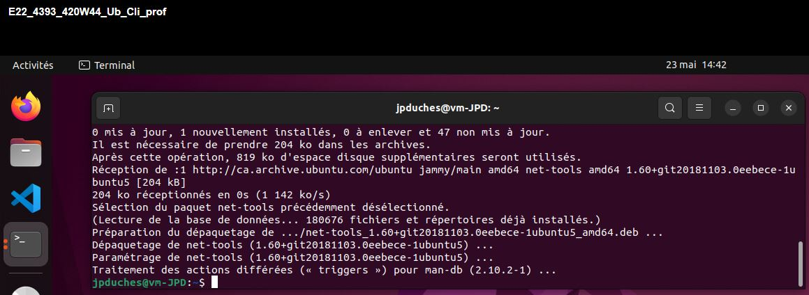
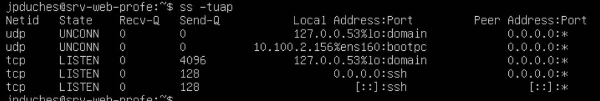
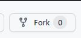
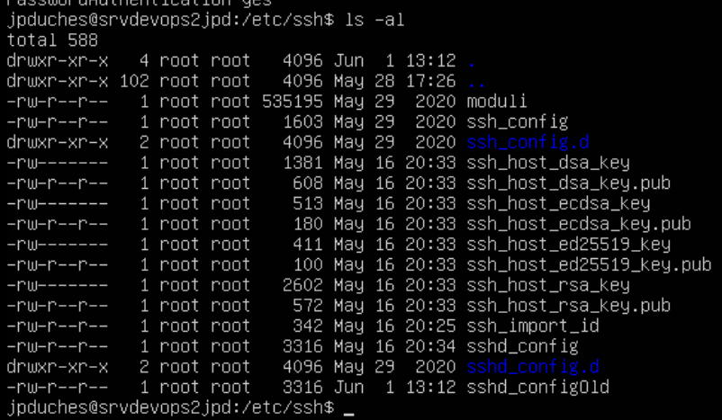

# Exercice 4 - prise en main de votre serveur et accès distant

- Évaluation : formative
- Type de travail : individuel
- Durée estimée : 2 heures
- Système d'exploitation : Linux Ubuntu serveur 22.04
- Environnement : virtuel, vsphere.

### Objectifs

Cet exercice a pour objectifs:

- Établir une connexion ssh
- Faire la mise à jour
- Vérifier les logs
- Utiliser des clés privées et publiques
- Gérer un serveur à distance
- Sécuriser l'accès SSH

## Pour vérification

Vous devez remettre un document Word contenant les vérifications demandées.

## Section 1 Prise en main de votre serveur

Quand vous vous connectez à votre serveur, certaines [informations](images/Connexion.png) importantes vous sont fournies. L'adresse IP est l'une de plus importante. Notez là.


Lors de l'installation, vous avez coché oui à l'installation d'un serveur SSH.
SSH signifie Secure SHell. C’est un protocole qui permet de faire des connexions sécurisées (c.-à-d. chiffrées) entre un serveur et un client SSH.

<blockquote>Celui-ci va permettre aux utilisateurs d'accéder au système à distance, en rentrant leur login et leur mot de passe (ou avec un mécanisme de clefs).

**Le système de clefs de SSH**

SSH utilise la cryptographie asymétrique RSA ou DSA. En cryptographie asymétrique, chaque personne dispose d’un couple de clefs : une clé publique et une clef privée. La clé publique peut être librement publiée tandis que la clef privée doit rester secrète. La connaissance de la clef publique ne permet pas d’en déduire la clé privée.

Un serveur SSH dispose d’un couple de clefs RSA stocké dans le répertoire /etc/ssh/ et généré lors de l’installation du serveur. Le fichier ssh_host_rsa_key
contient la clef privée et a les permissions 600. Le fichier ssh_host_rsa_key.pub contient la clef publique et a les permissions 644.


**Voici les étapes de l’établissement d’une connexion SSH**

1. Le serveur envoie sa clef publique au client. Celui-ci vérifie qu’il s’agit bien de la clef du serveur, s’il l’a déjà reçue lors d’une connexion précédente.
2. Le client génère une clef secrète et l’envoie au serveur, en chiffrant l’échange avec la clef publique du serveur (chiffrement asymétrique). Le serveur déchiffre cette clef secrète en utilisant sa clé privée, ce qui prouve qu’il est bien le vrai serveur.
3. Pour le prouver au client, il chiffre un message standard avec la clef secrète et l’envoie au client. Si le client retrouve le message standard en utilisant la clef secrète, il a la preuve que le serveur est bien le vrai serveur. 
4. Une fois la clef secrète échangée, le client et le serveur peuvent alors établir un canal sécurisé grâce à la clef secrète commune (chiffrement symétrique).
5. Une fois que le canal sécurisé est en place, le client va pouvoir envoyer au serveur le login et le mot de passe de l’utilisateur pour vérification. La canal sécurisé reste en place jusqu’à ce que l’utilisateur se déconnecte.


Il y a donc trois contraintes majeures pour garder un système sécurisé après avoir installé un serveur SSH :

1. avoir un serveur SSH à jour au niveau de la sécurité, ce qui doit être le cas si vous faites consciencieusement les mises à jour de sécurité en suivant la procédure;
2. que les mots de passe de TOUS les utilisateurs soient suffisamment complexes
pour résister à une attaque en force brute ;
3. surveiller les connexions en lisant régulièrement le fichier de log /var/log/auth.log.

Source : Les citations sur SSH proviennent de : Formation Debian GNU/Linux ECP, janvier 2013, document PDF.</blockquote>


<i>Nous aborderons la notion de sécurité et la lecture des logs plus tard.</i>

### L’établissement d’une connexion SSH

**Connexion depuis votre poste de développeur**

Utilisez votre machine Ubuntu client (poste de développeur) pour établir une connexion avec votre serveur.

- Dans un terminal sur le poste client entrer la commande :

```bash
$ssh username@ip_serveur [-p port]
```

- Remarquez l'échange de la clé lors de la première connexion.
- Vérifier par quelques commandes que vous êtes bien sur le serveur : 

```bash
$uname
$hostnamectl
$ip a
$ss -tunap # Vous devriez voir votre connexion SSH.
$df
$pwd
```

- Entrer les mêmes commandes dans un autre terminal, mais cette fois pour votre poste client. 
- Au besoin, vérifier le manuel de chaque commande (man).

### Faire les mises à jour 

<blockquote>
L’instruction **apt update** va rechercher les mises à jour disponibles pour votre système et vos programmes installés en se basant sur les sources définies dans /etc/apt/source.list. Un fichier d’index est créé pour lister les mises à jour disponibles. Il servira de référence pour l’installation de nouvelles mises à jour.

L’option **apt upgrade** installe les mises à jour identifiées avec apt update sans supprimer les paquets installés. S’il y a de nouvelles dépendances à installer, les paquets peuvent être installés ou non selon le type de commande utilisée apt, apt-get ou aptitude.

Les options **apt dist-upgrade** ou **full-upgrade** sont identiques, utiliser l’une ou l’autre revient donc au même.

Ces deux options agissent plus « intelligemment » que la fonction upgrade. En plus de mettre à jour les paquets existants, elles vont également être en mesure de gérer les dépendances. Si de nouveaux paquets doivent être installés pour satisfaire des dépendances, ils le seront. Ceux qui ne sont plus utiles, sont supprimés et les paquets essentiels ou requis, sont installés. Les paquets les plus importants sont traités en priorité.

**Dois-je utiliser apt upgrade ou apt full-upgrade?**

Dans un environnement hautement critique et qui doit rester stable, la commande upgrade est plus sûre. Si vous désirez faire une opération de mise à jour courante et minorer le risque, il en est de même. Seuls les paquets actuellement installés sont traités. Les risques de dysfonctionnement suite à la suppression ou l’installation d’un nouveau paquet sont réduits.

Dans la plupart des autres cas, l’option dist-upgrade ou full-upgrade est à privilégier, car vous obtiendrez toutes les dernières mises à jour sur votre système et du noyau. Lorsque vous souhaitez changer de version majeure de distribution (par exemple pour passer de Debian 8 à Debian 9), c’est cette commande que vous devez utiliser.

Dans tous les cas, je vous conseille vivement de réaliser une sauvegarde avant toute mise à jour et de réaliser des essais au préalable sur un environnement de test.

Source : [https://www.lecoindunet.com/difference-apt-update-upgrade-full-upgrade](https://www.lecoindunet.com/difference-apt-update-upgrade-full-upgrade) </blockquote>

- Entrez les commandes suivantes sur votre serveur : 

```bash
$sudo apt update
$sudo apt upgrade -y
```

- Entrez les commandes suivantes sur poste client : 

```bash
$sudo apt update
$sudo apt full-upgrade -y
```

### Vérifier les logs du serveur

- Entrez la commande suivante sur votre  poste client et sur le serveur pour observer les connexions.


```bash
$tail /var/log/auth.log
```

#### Vérifier des droits sur des fichiers et des répertoires

Pour comprendre les droits : [https://doc.ubuntu-fr.org/droits](https://doc.ubuntu-fr.org/droits), nous y reviendrons dans un prochain cours.

- Vérifier les droits sur le fichier des logs :

```bash
$ls -l /var/log/auth.log
```

- Garder les informations pour la comparer plus tard. Notez les droits de cette façon :


    **exemple appliqué sur <code>/var/log/auth.log</code>**


     `-rw-r----- syslog adm`

   - ici, on a fichier, première lettre (-)
   - lire, écrire, null (non exécutable) pour le propriétaire
   - lecture seulement pour le groupe
   - et aucun droit pour les autres
   - Le propriétaire est syslog et le groupe adm
   


- Comparer les droits avec ceux des fichiers suivants :


```bash
$ls -l /etc/passwd
$ls -l /etc/shadow
$ls -l /home # Regarder votre utilisateur.
```

Vous pouvez visualiser un exemple de résultats [ici](images/droit.png).

**Question** : Selon-vous, pourquoi seule root et le groupe shadow ont le droit lecture sur <code>/etc/shadow</code> et que tout le monde peut lire <code>/etc/passwd</code> ?

## Pour vérification

Remettre un document Word contenant les captures d’écran de la commande suivante pour les deux VMS.

```bash
$ls -l /var/log/auth.log
```


Je dois pouvoir vous identifier sur la capture.

Exemple de capture acceptable client: 



Exemple de capture acceptable serveur: 



## Section 2 Accès distant

## Utilisation de votre clé SSH sur GitHub


- Connectez-vous votre station de travail Ubuntu.
- Prenez la clé publique générée lors de l'exercice 1 et publiez-la sur votre compte GitHub. Bien sûr, si vous n'avez pas de compte créez-en un. Vous pouvez vous aider du livre Pro Git page 163. Ce livre est  disponible sur Léa.
- Rendez-vous sur mon dépôt à l'adresse [https://github.com/jpduchesneauCegep/test_ste_foy_ISS](https://github.com/jpduchesneauCegep/test_ste_foy_ISS)
- Faite un Fork de mon dépôt. Voir dans le coin droit cet outil :



**Question**: Qu'est-ce qu'un "fork" en Git?
<details>

> Les utilisateurs qui n’ont pas la permission de pousser sur un dépôt peuvent en faire un fork (créer leur propre copie), pousser des commits sur cette copie et ouvrir une requête de tirage (Pull Request) depuis leur fork vers le projet principal. Ce modèle permet au propriétaire de garder le contrôle total sur ce qui entre dans le dépôt et quand, tout en autorisant les contributions des utilisateurs non fiables.
Source : Pro Git

</details>

--

- Récupérer votre fork de mon dépôt par la commande <code>git clone nom\_de\_votre\_copie</code> sur votre poste de travail.
- Modifier le fichier README.md en y ajoutant votre nom dans la liste des contributeurs.
- Pousser votre modification sur votre dépôt sur Git Hub avec la commande <code>git push</code>. Si vous avez bien inséré votre clé SSH sur GitHub, vous ne devriez pas avoir besoin de vous authentifier.
- Sur votre page de GitHub, faites une demande de Pull Request pour que j'accepte de modifier le dépôt principal de votre contribution. Soyez gentil, écrivez un message avec votre demande.  Sinon, peut-être que je n’accepterais pas votre demande.;-)

Pour vous aider : [https://git-scm.com/book/fr/v2/GitHub-Contribution-%C3%A0-un-projet]

Votre clé SSH pourra être utilisée toute la session entre votre poste client et votre compte GitHub.

### Création d'un fichier de configuration personnel pour SSH

Lorsque vous installez SSH, un répertoire ~/.ssh est créé automatiquement. Ce répertoire contient votre clé publique, votre clé privée et un fichier known_hosts (après une première connexion). Votre configuration est également stockée ici.
Au moins sur Ubuntu, le fichier de configuration SSH n'est pas créé par défaut. Vous pouvez facilement créer ce fichier en utilisant la commande touch comme ceci :

```bash
$touch ~/.ssh/config
```


**Ajouter un profil SSH dans le fichier de configuration**

Ce fichier va vous permettre de garder les informations de connexions sur les différentes machines sur lesquels vous devez vous connecter par SSH.

Disons que vous vous connectez à un serveur dont l'IP est 10.100.2.50. Votre nom d'utilisateur est jpduches et le serveur est utilisé pour héberger votre site Web. Pour renforcer la sécurité de SSH, vous utilisez le port 1500 au lieu du port SSH 22 par défaut.

Vous pouvez ajouter toutes ces informations de la manière suivante dans votre fichier `~/.ssh/config`.

>**[!Attention]** il s'agit d'un exemple. Si vous voulez le tester, utilisé votre nom d'Usager, l'adresse IP de votre serveur et le port 22 puisqu'il n'a pas été modifié. 

```bash
Host website
        Hostname 10.100.2.50
        User jpduches
        port 1500
```     

- Il suffit de sauvegarder les informations dans le fichier. Il n'est pas nécessaire de redémarrer un service.
- Maintenant, au lieu d'écrire une longue commande comme celle-ci :

```bash
ssh jpduches@10.100.2.50 -p 1500
``` 

- Vous pouvez simplement utiliser cette commande (la complétion par tabulation fonctionne également) :

```bash
ssh website
``` 

Vous ajoutez autant de Hosts que vous en avez besoin.

Vous pouvez toujours vous référer à la page de manuel de <code>ssh_config</code>  (<code>man ssh\_config</code>)pour en savoir plus sur les paramètres que vous pouvez utiliser lors de la création de votre fichier de configuration SSH.

### Sécuriser l'accès SSH du serveur de test

>**[!Attention]** les commandes suivantes doivent être exécutées avec l'élévation des privilèges, donc entant que SUDO.

Établir une connexion ssh à votre serveur test.  

Les fichiers de configuration de SSH sont situés dans <code>/etc/ssh/</code>. Comme tout fichier de configuration qu'on modifie, il est nécessaire de les sauvegarder avant de les modifier. 

- Utilisez la technique suivante sur tous les fichiers de configuration que vous modifiez. Si j'aimais, il y a un problème, il est facile de revenir en arrière.

```bash
sudo cp /etc/ssh/sshd_config /etc/ssh/sshd_config.orig 
# Au besoin récupérer votre fichier ainsi : 
sudo cp /etc/ssh/sshd_config.orig /etc/ssh/sshd_config
``` 



Ouvrez le fichier de configuration du serveur sshd.

```bash
sudo nano /etc/ssh/sshd_config
# ou
sudo vim /etc/ssh/sshd_config
```

### 10 Techniques pour sécuriser votre serveur SSH :

**1- Désactiver les mots de passe vides :**

Oui, il est possible d'avoir des comptes utilisateurs sous Linux sans aucun mot de passe. Si ces utilisateurs essaient d'utiliser SSH, ils n'auront pas besoin de mots de passe pour accéder au serveur via SSH également.

C'est un risque pour la sécurité. Vous devriez interdire l'utilisation de mots de passe vides. Dans le fichier <code>/etc/ssh/sshd_config</code>, veillez vérifier que l'option <code>PermitEmptyPasswords</code> sur <code>no</code> (normalement, c'est l'option par défaut, donc commenté).

<code>PermitEmptyPasswords no</code>

**2- Changer le port SSH** 

Si vous connaissez les bases de SSH, vous savez déjà que SSH utilise le port 22 par défaut.

Lorsque vous vous connectez à un serveur via SSH, la plupart du temps, vous ne fournissez aucune information sur le port. Dans ce cas, votre connexion est dirigée vers le port 22 du serveur SSH.

Vous pouvez modifier le port par défaut de 22 à un numéro de port de votre choix en suivant les étapes suivantes :

- Localisez la ligne <code>Port 22</code> (s'elle est commentée par un #, supprimez le #).
- Changez la ligne en <code>Port 2522</code> (ou tout autre nombre de votre choix entre 1024 et 65535).
- Assurez-vous que le nouveau port est autorisé par les coupe-feu (si vous en avez).
- Redémarrez le démon ssh avec <code>sudo systemctl restart sshd.service</code>.

À partir de maintenant, vous devrez spécifier le port pour établir la connexion ssh ou utiliser votre fichier de configuration.

**3- Désactiver la connexion root via SSH**

L'utilisation du serveur en tant que root lui-même devrait être interdite. C'est risqué et cela ne laisse aucune trace d'audit. Des mécanismes comme sudo existent uniquement pour cette raison.

Si vous avez ajouté des utilisateurs sudo sur votre système, vous devez utiliser cet utilisateur sudo pour accéder au serveur via SSH au lieu de root.

- Vérifier que la connexion de root est désactivée avec l'option <code>PermitRootLogin</code> avec la valeur <code>no</code> (encore ici, l'option par défaut).

<code>PermitRootLogin no</code>

**4- Configurer le délai d'inactivité**

L'intervalle de délai d'inactivité est la durée pendant laquelle une connexion SSH, sans activité, peut rester active sans vérification de l'autre extrémité (s'il y a toujours un système en connexion). Ces sessions ouvertes constituent également un risque pour la sécurité. C'est une bonne idée de configurer un délai de vérification.

Le délai de vérification est exprimé en secondes et par défaut il est de 0 (pas de vérification, la valeur par défaut). Vous pouvez le changer en 300 pour conserver un délai d'attente de cinq minutes.

<code>ClientAliveInterval 300</code>

Après cet intervalle, le serveur SSH enverra un message de vie au client. S'il ne reçoit pas de réponse, la connexion sera fermée .

Vous pouvez également contrôler le nombre de fois qu'il envoie le message de vie avant de se déconnecter (la valeur par défaut est 3).

<code>ClientAliveCountMax 2</code>

**5- Autoriser l'accès SSH à des utilisateurs sélectionnés uniquement**

En matière de sécurité, vous devez suivre le principe du moindre privilège. Ne donnez pas de droits lorsque ce n'est pas nécessaire.
Vous avez probablement plusieurs utilisateurs sur votre système Linux. Devez-vous autoriser l'accès SSH à chacun d'entre eux ? Peut-être pas.  
Une approche dans ce cas serait d'autoriser l'accès SSH à quelques utilisateurs sélectionnés et de le restreindre pour tous les autres utilisateurs.

<code>AllowUsers User1 User2</code>

Vous pouvez également ajouter des utilisateurs sélectionnés à un nouveau groupe et autoriser uniquement ce groupe à accéder à SSH.

<code>AllowGroups ssh_group</code>

Vous pouvez également utiliser les options `DenyUsers` et `DenyGroups` pour refuser l'accès à SSH à certains utilisateurs et groupes.

**6- Atténuer automatiquement les attaques par force brute**

Pour contrecarrer les attaques SSH par force brute, vous pouvez utiliser un outil de sécurité comme Fail2Ban.

Fail2Ban vérifie les tentatives de connexion échouées à partir de différentes adresses IP. Si ces mauvaises tentatives franchissent un seuil dans un intervalle de temps donné, il interdit à l'IP d'accéder à SSH pendant une certaine période.

Vous pouvez configurer tous ces paramètres en fonction de vos préférences et de vos besoins. Il y a un guide d'introduction détaillé sur l'utilisation de Fail2Ban que vous pouvez lire.

https://linuxhandbook.com/fail2ban-basic/

**7- Désactiver la connexion SSH basée sur un mot de passe**

Quels que soient vos efforts, vous verrez toujours de mauvaises tentatives de connexion via SSH sur votre serveur Linux. Les attaquants sont intelligents et les scripts qu'ils utilisent prennent souvent en charge les paramètres par défaut des outils de type Fail2Ban.

Pour vous débarrasser de ces attaques constantes par force brute, vous pouvez opter pour des connexions SSH basées uniquement sur des clés.

Dans cette approche, vous ajoutez la clé publique des systèmes clients distants à la liste des clés connues sur le serveur SSH. De cette façon, ces machines clientes peuvent accéder à SSH sans saisir le mot de passe du compte utilisateur.

Lorsque vous avez cette configuration, vous pouvez désactiver la connexion SSH basée sur le mot de passe. 

Désormais, seules les machines clientes qui possèdent les clés SSH spécifiées peuvent accéder au serveur via SSH.

**Attention :** Avant d'opter pour cette approche, assurez-vous que vous avez ajouté votre propre clé publique au serveur et qu'elle fonctionne. Sinon, vous vous bloquerez et vous risquez de perdre l'accès au serveur distant, surtout si vous utilisez un serveur en nuage où vous n'avez pas d'accès physique au serveur.

Avant de le faire, vous devez garder à l'esprit les points suivants :

- Veillez à créer votre paire de clés ssh sur votre ordinateur personnel/professionnel et ajoutez cette clé SSH publique au serveur afin que vous puissiez au moins vous connecter au serveur.
- La désactivation de l'authentification par mot de passe signifie que vous ne pouvez pas vous connecter à votre serveur à partir d'ordinateurs aléatoires.
- Vous ne devez pas perdre vos clés ssh. Si vous formatez votre ordinateur personnel et perdez les clés ssh, vous ne pourrez jamais accéder au serveur.
- Si vous êtes verrouillé, vous ne pourrez jamais accéder à votre serveur.

**Comment procéder:**

**Copier votre clé SSH sur votre serveur de test**

- S'il n'existe pas, créer le dossier <code>.ssh</code> dans votre usager sur le serveur et créer le fichier <code>authorized_keys</code> dans le dossier

- Par la suite, sur votre client à l'aide de la commande <code>ssh-copy-id</code> (non disponible sous Windows) ou la commande <code>scp</code> copiez votre clé SSH sur votre serveur.

```bash
ssh-copy-id -i .ssh/id_ed25519 {votreusager}@{adresse IP du serveur}
# Entrer le mot de passe de l'usager.
```

- Vous pouvez par la suite vous connecter au serveur sans enter de mot de passe. 

- Éditez le fichier /etc/ssh/sshd_config
    - Trouvez la ligne <code>PasswordAuthentication yes</code>
    - Changer la pour <code>PasswordAuthentication no</code>
    - S'il y a un # (signifie commenté) au début de cette ligne, supprimez-le.
    - Vérifier que <code>PubkeyAuthentication yes</code> n'a pas été changé.
    - Si vous voulez utiliser un autre fichier que <code>.ssh/auhtorized_keys</code>, décomenter la ligne <code>AuthorizedKeysFile</code> et indiqué le nom de votre fichier.
 - Sauvegardez le fichier après avoir effectué ces modifications et redémarrez le service SSH.

```bash
systemctl restart ssh.service
``` 

- Testez la connexion depuis votre client vers votre serveur

**8- Aller plus loin avec l'authentification à deux facteurs avec SSH**

Pour faire passer la sécurité SSH au niveau supérieur, vous pouvez également activer l'authentification à deux facteurs. Dans cette approche, vous recevez un mot de passe à usage unique sur votre téléphone portable, par courriel ou par le biais d'une application d'authentification tierce.

Vous trouverez ici des informations sur la configuration de l'authentification à deux facteurs avec SSH.

https://www.linode.com/docs/guides/use-one-time-passwords-for-two-factor-authentication-with-ssh-on-ubuntu-16-04-and-debian-8/

**9- Désactiver le transfert X11**

Le X11 ou le serveur d'affichage X est le cadre de base d'un environnement graphique. La redirection X11 vous permet d'utiliser une application GUI via SSH.
En principe, le client exécute l'application GUI sur le serveur, mais grâce à la redirection X11, un canal est ouvert entre les machines et les applications GUI sont affichées sur la machine cliente.
Le protocole X11 n'est pas axé sur la sécurité. Si vous n'en avez pas besoin, vous devriez désactiver la redirection X11 dans SSH.

<code>X11Forwarding no</code>

**10- Désactiver le protocole ssh 1**

Si vous utilisez une ancienne distribution Linux. Certaines versions plus anciennes de SSH peuvent encore avoir le protocole SSH 1 disponible. Ce protocole présente des vulnérabilités connues et ne doit pas être utilisé.

Les versions plus récentes de SSH ont automatiquement activé le protocole 2, mais il n'y a pas de mal à le vérifier.

---

Ceci n'est pas une liste exhaustive de sécurisation de votre connexion ssh (il existe la gestion centralisée, les filtres...), mais c'est un bon début.

## Pour vérification

- Inclure dans votre fichier Word de remise, une capture d'une connexion ssh à partir du fichier de configuration qui permet de vous connecter à votre serveur distant sous le nom de website.

```bash
ssh website
``` 

Je dois pouvoir voir la commande et le résultat de connexion sur votre serveur.


### Références

Plusieurs parties de cet exercice proviennent du site Web https://linuxhandbook.com/
https://www.ssh.com/academy/ssh/session-key
