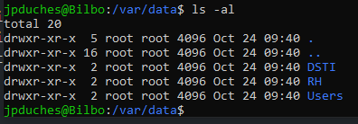
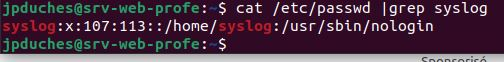

# Exercice 5 - Administration d'un système Linux

### Informations
- Évaluation : formative
- Type de travail : individuel
- Durée : 3 heures
- Système d'exploitation : Linux Ubuntu client et serveur 24.04
- Environnement : virtuel, vsphere.

### Objectifs

- Effectuer des tâches de gestion du système d’exploitation.
- Création correcte des comptes et des groupes d’utilisateurs.
- Attribution correcte des droits d’accès.
- Gestion appropriée des processus, de la mémoire et de l’espace disque.
- Localiser l'emplacement et la taille du noyau (kernel) Linux.
- Localiser les modules associés au noyau de Linux.
- Vérifier les modules chargés en mémoire.
- Localiser les fichiers sources de Linux.
- Utiliser des commandes d'administration système.

## Pour vérification

Vous devez remettre un document Word contenant les vérifications demandées.

## Section 1 Gestion des utilisateurs

### Création d'usagers

- Connectez-vous à votre serveur depuis votre station de travail.

- Vérifier la présence du groupe suivant, s'il n'est pas présent, créer-le :

|Groupe 		| Membres |
|----------  | ---------- |
| users      | tous les usagers du système |

```bash
cat /etc/group | grep users
```

- Créez les usagers du tableau ci-dessous.
- Pour les login respectez la nomenclature première lettre du prénom et le nom. 
- ATTENTION : Tous ces utilisateurs doivent être membre du groupe  **users** vérifier avec le <code>man adduser</code> pour savoir comment y parvenir.
- Vérifier la présence du shell avant de l'ajouter à la commande.


|Nom            | Répertoire    | Mot de passe  | Interpréteur de commande |
|----------     | ----------    | ------------- |------------- |
| Éric Bédard   | /home/ebedard | S0l&il01      |/bin/bash |
| Joanie Slyte  | /home/jslyte  | S0l&il01      |/bin/bash |
| Raja Ayadi    | /home/rayadi  | S0l&il01      |/bin/sh |
| Usager1       | aucun     	  | aucun         | /sbin/nologin  |


Exemple de création (il manque des paramètres) : 

```bash
$sudo adduser ebedard
```

<details>
Pour ajouter les membres dans le groupe <code>users</code>, vous devez éditer le fichier <code>/etc/adduser.conf</code> pour permettre l'utilisation du paramètre <code>--add\_extra\_groups</code>. Vous devez décommenter la variable EXTRA\_GROUPS et l'éditer pour laisser seulement le groupe <code>users</code>.

Voici des exemples de la création d'utilisateurs, après avoir éditer le fichier <code>/etc/adduser.conf</code>.

```bash
$sudo adduser ebedard --add_extra_groups
$sudo adduser jslyte --add_extra_groups
$sudo adduser rayadi --shell /bin/sh --add_extra_groups
$sudo adduser Usager1 --shell /sbin/nologin --add_extra_groups --force-badname --no-create-home --disabled-login
```
</details>
- Créer ou utiliser les groupes suivants et  ajouter les bons usagers aux membres des groupes  :

|Groupe | Membres |
|----------     | ----------    |
| users | tous les usagers du système |
| admin | Vous et Raja Ayadi |
| cdrom | tous les usagers du système |
| rh | Eric Bédard et Joanie Slyte |  

<details>
Exemples :

```bash
$sudo group add admin
$sudo usermod -aG admin rayadi
```

</details>

- Modifier les mots de passe des utilisateurs **ebedard** et **jslyte** pour "Pa$$word01"

### Création d’une structure de fichiers

- Créez la structure suivante sur le serveur : 



- Modifiez les attributs de ces répertoires de la manière suivante :

1- DSTI : 

   - Propriétaire : root  
   - Accessible en lecture, écriture et exécution pour le propriétaire  
   - Accessible en lecture, écriture et exécution pour le groupe admin  
   - Pas accessible pour les autres  

2- RH :  

   - Propriétaire : root  
   - Accessible en lecture, écriture et exécution pour le propriétaire  
   - Accessible en lecture, écriture  pour le groupe rh  
   - Pas accessible pour les autres  

3- Users :  

   - Propriétaire : root  
   - Groupe : users  
   - Accessible en lecture, écriture et exécution pour le propriétaire  
   - Accessible en lecture, écriture et exécution pour le groupe users  
   - Accessible en lecture, écriture et exécution pour les autres  
   - Placer un sticky bit sur le répertoire  

### Utilisation de liens symboliques

- Pour tous les usagers, sauf root, créer un lien symbolique dans son répertoire personnel vers /var/data.
- La commande doit être faite à partir de votre usager principal sans avoir à vous déplacer dans l'arborescence.
- Connectez-vous avec l'un des usagers pour vérifier le fonctionnement du lien symbolique.

## Pour vérification
Remettre, dans le document Word de remise, une capture d’écran des commandes suivantes:

```bash
tail -n 4 /etc/passwd
#On ne voit pas cdrom dans le tail /etc/group.
#cat /etc/group | grep cdrom serait conseillé pour le voir
tail /etc/group
ls -l /var/data
```

## Section 2 Administration système

### Environnement Linux

- Connectez-vous à votre serveur depuis votre station de travail.
- Affichez la version de votre noyau :

```bash
cat /proc/version 
# Ou 
uname -r
```

- Localisez le  noyau Linux et donnez sa taille :

```bash
cd /boot
```

- Dans ce répertoire, le noyau compressé et binaire Linux commence avec le mot vmlinuz-*version*.
- Regardez son nom complet et sa taille :

```bash
ls -lh
```

- À partir des liens symboliques, essayez de déterminer qu'elle est la version utilisée.
- Pour voir les modules qui peuvent être associés au noyau : 

```bash
cat /proc/modules | less
```

- Ce sont tous les modules actifs avec le kernel.
- Entrez la commande :

```bash
lsmod |less
```

- Faire <code>man lsmod</code>, y a t'il un manuel pour cette commande ?
- Si le manuel n'est pas installé sur votre machine, cherchez sur le Web pour trouver des informations.
- On vous proposera aussi de lire sur <code>modprobe</code> et <code>modinfo</code>.
- Essayer la commande suivante: 

```bash
modinfo cryptd
```

- Vous voyez un module qui est responsable de cryptographies asynchrones.
- Entrez la commande 

```bash
lsmod|grep ip_tables
```

- Trouvez-vous le module nommé <code>ip_tables</code> (firewall Linux) ?
- Entrez maintenant la commande :

```bash
sudo iptables -vnL 
```

- Cette commande affiche les règles du coupe-feu par défaut. Actuellement, il y a seulement les règles de coupe-feu de Docker.

[Pour en savoir un peu plus sur iptables](https://www.linuxtricks.fr/wiki/iptables-quelques-trucs-utiles)

- Vous pouvez refaire l'ensemble de la partie précédente sur votre poste client. Pour voir s’il y a des différences.

### Commandes d'administration  système

#### Les disques 
- Vous connaissez déjà la commande :

```bash
df -H
```

- Essayons maintenant 

```bash
sudo fdisk -l | less
```

- Essayons maintenant les commandes pour voir les partitions LVM: 

```bash
sudo pvdisplay
sudo vgdisplay
sudo lvdisplay
```

- Afficher le contenu du fichier /etc/fstab

```bash
sudo cat /etc/fstab
```

**Question** : Quel est l'utilité du fichier /etc/fstab ?
- Essayez <code>man fstab</code>,

<details>
Le fichier fstab (file systems table) est la table des différents systèmes de fichiers sur un ordinateur sous Unix/Linux : il contient une liste des disques utilisés au démarrage et des partitions de ces disques. Pour chaque partition, il indique comment elle sera utilisée et intégrée à l’arborescence du système de fichiers global (c'est-à-dire le point de montage).
</details>

#### Gestion des processus

- Entrez la commande 

```bash
ps 
```

- Vous voyez les processus appartenant à votre usager.
- Ajouter les paramètres suivants : 

```bash
ps aux
```

- Vous voyez maintenant l'ensemble des processus de votre système. Remarquer la dernière ligne, elle représente la commande que vous venez d'exécuter  qui est elle aussi un processus.
- Entrez la commande :

```bash
ps -ef
```

**Question** : Indiquer  quel est le processus qui est au tout début et qui est considéré comme le père de tous les processus

<details>

```bash
UID      PID     PPID   C STIME  TTY          TIME CMD
root      1        0    0 May04  ?        00:00:04 /sbin/init
```

</details>

- Entrez la commande :

```bash
$ps aux |grep syslog
```

- Vous devriez voir deux processus : 
    - Le premier est le processus syslog (/usr/sbin/rsyslogd).
    - le deuxième est votre commande ps aux avec le grep.

**Question** : qui est le propriétaire du processus rsyslogd ?
<details>
syslog
</details>

**Question** : trouvez le numéro de l'usager qui est propriétaire du  processus  ?

<details>

cat /etc/passwd |grep syslog



</details>

**Question** est-ce que cet usager a accès au Shell ?

<details>

non   
syslog:x:107:113::/home/syslog:/usr/sbin/nologin

</details>

**Question** est-ce que cet usager est membre d'un groupe ?

<details>
oui de 2 groupes.(adm et syslog)  s
cat /etc/group |grep syslog
</details>

<hr>

**Sur votre poste client :**
- Entrez la commande top

```bash
top
```

- Remarquez les informations suivantes : le nombre total de tâches affichées, l'utilisation du CPU, la mémoire vive et la partition d'échange SWAP.
- Laissez la commande top et ouvrez le navigateur Firefox
- Dans une autre fenêtre de commandes, entrez les commandes suivantes : 

```bash
pidof firefox
# Vous devriez avoir plusieur processus.pki
kill $(pidof firefox)

# Firefox s'est fermé
```

### La recherche de fichiers

- Entrez la commande :

```bash
cd
```

**Question**  : Dans quel répertoire vous ramène cette commande  ? 

<details>
- Utiliser <code>pwd</code> pour vous aider.
- Vouz devez être dans votre répertoire d'usager.

Remarque : votre répertoire personnel par défaut est indiqué par le tilde dans l’invite de commandes.
</details>

***Attention***: Au besoin installer le package <code>plocate</code>.

```bash
sudo apt install plocate
```

- Entrez la commande :

```bash
touch toto
#suivie de :
locate toto
```

**Question** : Est-ce que votre fichier nouvellement créé a été trouvé ?

<details>
Non vous ne trouver pas le fichier. Car <code>locate</code>, cherche dans une base de données. Si celle-ci n'a pas été mise à jour. Vous ne pouvez pas trouver les informations.
Pour mettre à jour la base de données sur lequel se fie l'index utilisé par la commande locate, il faut utiliser la commande <code>sudo updatedb</code> (régulièrement).
</details>

- Entrez la commande <code>sudo updatedb</code> et refaire ensuite la commande <code>locate toto</code> vous devriez maintenant trouver le fichier toto.
- Entrez maintenant la commande :

```bash
touch toto2
#suivie de :
locate toto2 # Rien la bd n'est pas mise à jour.

# allons-y plutôt avec find :
find . -name toto2
```

**Question** : Est-ce que le fichier nouvellement créé a été trouvé ?
<details>
Oui 
<code>find</code>, cherche dans le système de fichier. La commande n'a pas besoin d'index. La commande find est un outil puissant qui permet aux administrateurs système de localiser et de gérer des fichiers et des répertoires en fonction d'un large éventail de critères de recherche. Il peut trouver des répertoires et des fichiers par leur nom, leur type ou leur extension, leur taille, leurs autorisations, etc.
Son apprentissage vous fera gagner beaucoup de temps.

La syntaxe générale de la commande find est :
```bash
find {path} {name -of-file or dir-to-search} {action-to-take}
```

- path : spécifie le répertoire de recherche
- name -of-file or dir-to-search :Nom du fichier ou du répertoire à rechercher
- action-to-take : comme copier, supprimer, déplacer, etc.
</details>

- Entrez maintenant la commande :

```bash
find / -name toto2
```

**Question** : pourquoi avez-vous des messages d'erreur ?

<details>
Vous faites une recherche sur la racine (/) donc dans des répertoires ou vous n'avez pas de droit de lecture.

Changez la commande en ajoutant sudo devant et ça vas fonctionner. Mais le temps de réponse est un peu long, car vous lui avez demandé de chercher dans toutes l'arborescence de fichier (/) et non seulement dans l'emplacement courante (.).
</details>

- Entrez maintenant la commande :

```bash
which find
#suivi de :
man which
```

<hr>

### Vérifier votre configuration réseau

**Sur votre serveur :**

Pour vérifier la configuration de votre réseau :

- D'abord vérification des adresses IPs.

```bash
ip -4 a
```

- La passerelle doit être vérifiée pour savoir si on peut sortir du réseau local. 

```bash
ip route
# default est votre passerelle.
# Vérifier la réponse de la passerelle par un ping 
ping -c 3 {Adresse IP passerelle}
# Probablement l'adresse IPv4 : 10.100.2.1
```

- Par la suite, nous voulons savoir si la résolution de nom fonctionne : 

```bash
# Résolution de nom au niveau local :
cat /etc/hosts
ping localhost # Ping sur la boucle local
ctrl-c # Pour arrêter les  ping
ping -c 3 [nomVotreMachine] # C'est l'autre nom avec une adresse débutante par 127.

# Résolution de nom au niveau des serveurs DNS

resolvectl status 
```

- Vérifier si vous atteigniez les serveurs DNS : 

```bash
ping -c 3 {Adresse IP DNS}
```

- Ping sur un FQDN (Full qualified domain name)

```bash
ping -c 3 {domaine de votre choix}
```

- Si tous fonctionnent, vous êtes satisfait ;-) 

Vous avez une connectivité avec Internet.

## Pour vérification
Remettre, dans le document Word de remise, une capture d’écran de la commande suivante :

```bash
ping -c 3 google.ca
```


#### Lecture complémentaire :

[Tutoriel pour comprendre et changer de noyaux Linux avec Ubuntu 20.04 LTS](https://lafibre.info/serveur-linux/noyaux-linux/)


