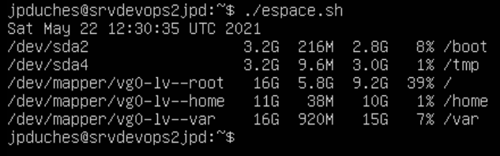

# Exercice 5 - Installation d'un environnement de tests sur site


- Évaluation : formative
- Type de travail : individuel
- Durée estimée : 2 heures
- Système d'exploitation : Linux Ubuntu client et serveur
- Environnement : virtuel, vsphere.


Dans cet exercice, nous allons mettre en place un environnement de tests. Pour rappel, c'est l’environnement de simulation. Généralement, l’environnement
de simulation est identique à celui de production, si bien que le matériel
et les logiciels ne présentent pas de grandes différences lors de
l’utilisation de l’application.

Ici nous aurons les composants suivants :  

- Nginx : serveur Web  
- MySQL : serveur de bases de données  
- PHP : Langage de programmation.

## Pour vérification
Remettre une capture d’écran de votre navigateur avec la fenêtre info.php affichée.  
N'oubliez pas, je dois pouvoir identifier votre VMs.

## Mise à jour du système

Il est une bonne habitude de mettre à jour vos dépôts et votre système avant de procéder à des installations.

- Procéder à la mise à jour de votre poste client: 

```bash
sudo apt update && sudo apt full-upgrade -y
```

- Utilisez votre machine Ubuntu client (poste de développeur) pour établir une connexion avec votre serveur.

```bash
ssh username@{adresse ip du serveur} [-p port]
```
 
>[Attention] nous allons régulièrement avoir besoin d'un éditeur de texte en mode console. Vous pouvez utiliser l'un des éditeurs suivants : 

 >**nano** c'est l'éditeur le plus basique, intégré à Ubuntu par défaut.

 >**vim** (ou vi) dans 99% des systèmes Unix/Linux vi est présent. Il est plus difficile à apprivoiser, mais très puissant. Voici un tutoriel en français si vous voulez vous y mettre : [L'éditeur de Texte VI](https://linux.goffinet.org/administration/traitement-du-texte/editeur-de-texte-vi/)

- Vérifiez l'espace disque avant l'installation des applications supplémentaires. Si ce n'est pas fait, créer un script bash pour avoir l'information d'espace disque. (voir dans détails)

<details>
- Pour ce faire créer un script bash sur votre serveur que vous pourrez utiliser de façon périodique :

```bash
mkdir scripts
cd scripts
nano espace.sh
```

Contenu du script :

```bash
#!/bin/bash
# Variable du fichier qui va garder les informations :
Fichier="./espaceDisque.txt"

date >> $Fichier   # pour avoir la date et l'heure de l'exécution.
df -H | grep /dev/sda >> $Fichier # Envoi de l'information dans le fichier
df -H | grep /dev/mapper/ubuntu--vg-ubuntu--lv  >> $Fichier
# Le script va afficher le résultat
cat $Fichier
```

- Sauvegardez votre fichier en tapant sur Crtl+X et répondez *Yes*
- Faite la commande suivante pour rendre le script bash exécutable : 

```bash
$chmod a+x espace.sh
#Pour exécuter votre script bash :
./espace.sh
```
Voici le résultat attendu :


</details>

- Procédez à la mise à jour du serveur.

```bash
sudo apt update && sudo apt upgrade -y
```
- Lancez votre script <code>espace.sh</code>.
- Vous ne devriez pas voir une différence notable, car une mise à jour ne prend pas beaucoup d'espace disque.  


## Installation NGINX


```bash
sudo apt install nginx -y
```

- Vérifiez le fonctionnement du serveur en tapant la commande suivante :  

```bash
sudo systemctl status nginx
```

- Véfifiez le fonctionnement de votre serveur Web dans votre navigateur du poste client. ([images](images/nginx.png))


## Installation MySQL Serveur 8.0

- Nous allons utiliser la version mysql-server-8.0.  

```bash
sudo apt install mysql-server-8.0 -y
```

- Installez le script de sécurité MySQL. ([Documentation MySQL](https://dev.mysql.com/doc/refman/8.0/en/mysql-secure-installation.html))
- Ce programme vous permet d'améliorer la sécurité de votre installation MySQL de la manière suivante :
    - Vous pouvez définir un mot de passe pour les comptes root.
    - Vous pouvez supprimer les comptes root qui sont accessibles depuis l'extérieur de l'hôte local.
    - Vous pouvez supprimer les comptes d'utilisateurs anonymes.
    - Vous pouvez supprimer la base de données de test (à laquelle tous les utilisateurs, même les utilisateurs anonymes peuvent accéder par défaut) et les privilèges qui permettent à quiconque d'accéder aux bases de données dont le nom commence par test_.

```bash
sudo mysql_secure_installation
```

- Le plug-in validate\_password peut être utilisé pour vérifier la force des mots de passe. Si le plug-in n'est pas installé, mysql\_secure\_installation demande à l'utilisateur s'il doit l'installer. Tous les mots de passe saisis ultérieurement sont vérifiés à l'aide du plug-in s'il est activé. 
- Le système vous demandera le mot de passe root MySQL. Entrez Y.
- Ensuite, le programme d’installation décrira les fonctionnalités du plug-in Validate Password. Vous devrez sélectionner le niveau de sécurité. 
    - Vous devez utiliser  **2 pour STRONG** . 
    - Nous devons placer notre serveur comme si nous étions en production, et non en développement comme votre poste client. Donc le niveau de sécurité et plus important.
    - Vous devez par la suite répondre au niveau de politique de validation des mots de passe :  STRONG Longueur >=8 numérique, chargement de la case, caractères spéciaux et ne pas être un mot du dictionnaire.
    - **Exemple** : e4l*j3Wj

- Votre mot de passe root devra suivre toutes les exigences que vous avez configurées à l’étape précédente.
- Le système vous demandera les fonctions de sécurités suivantes : 
    - Supprimer les utilisateurs anonymes ? Y
    - Désactiver la connexion root à distance ? Y
    - Supprimer la base de données de test et y accéder ? Y
    - Recharger les tables de privilèges maintenant ? Y


![Attention] : Si vous avez cette erreur : 

```
Failed! Error: SET PASSWORD has no significance for user ‘root’@’localhost’ as the authentication method used doesn’t store authentication data in the MySQL server. Please consider using ALTER USER instead if you want to change authentication parameters
```

Faite ce qui suit dans details :
<details>

 - Tout d'abord, vous devez changer les paramètres d'authentification. Pour ce faire, exécutez d'abord cette commande.

 ```bash
 sudo mysql
 ```
 
 - Ensuite, exécutez cette requête ALTER pour changer les paramètres d'authentification.
 
```sql
ALTER USER 'root'@'localhost' IDENTIFIED WITH mysql_native_password by 'mynewpassword';
```

Et maintenant, vous êtes en mesure d'exécuter la commande mysql\_secure\_installation.
 
```bash
sudo mysql_secure_installation
```
 
Maintenant, votre erreur doit être résolue.
 
Source : https://exerror.com/failed-error-set-password-has-no-significance-for-user-rootlocalhost-as-the-authentication-method-used-doesnt-store-authentication-data-in-the-mysql-server/
 
</detail>

- Vérifiez que MySQL fonctionne, entrer le commande : 
```bash
sudo service mysql status
``` 
- Par curiosité, lancer votre script d'espace disque. Vous verrez combien d'espace disque utilise le serveur de base de données MySQL sans la présence des bases de données bien sûr. 

</details>

```bash
./espace.sh
```

[Cliquez pour voir  mon résultat](images/espace2.png)
- Remarquez seule les partitions /root et /var ont changés.

- Vérifier les connexions possibles au serveur MySQL (vérifie si nous avons un port d'écoute) : 

```bash
sudo ss -tunap | grep 3306
```
Résultat attendu : 

```bash
LISTEN 0    151    127.0.0.1:3306	    0.0.0.0:*    users:(("mysqld,pid2791,fd=23))
LISTEN 0    70     127.0.0.1:3306       0.0.0.0:*    users:(("mysqld,pid2791,fd=21))
```

### Tester l’installation de MySQL

Le client MySQL a également été installé. Nous allons l’utiliser pour tester notre installation.  

— Entrez la commande suivante pour accéder au client :

```bash
sudo mysql -u root -p
```

- Entrez le nouveau mot de passe de root tel que défini plus haut.

[Cliquez pour voir  mon résultat](images/conMySQL.png)

- Quelques vérifications d'usages : 

```bash
show databases;
select user, host from mysql.user;
```

- Création d'un usager pour l'administration :  

```bash
CREATE USER 'admin'@'localhost' IDENTIFIED BY 'change-with-your-secure-password';
GRANT ALL PRIVILEGES ON *.* TO 'admin'@'localhost' WITH GRANT OPTION;
```

- Vérifier la présence de l'usager : 

```bash
select user, host from mysql.user;
quit
```

## Le langage de programmation PHP

Procéder à l'installation de php et ses différent modules.

```bash
sudo apt install php-fpm php-cli php-mysql php-curl php-json -y
```

- Maintenant, vous devez éditer le fichier de configuration du site virtuel par défaut de Nginx (plus tard dans la session nous allons aborder les notions sur les fichiers de configuration de Nginx).
- Mais avant d'éditer un fichier de configuration, procéder toujours à une copie de sauvegarde comme ceci : 

```bash
sudo cp /etc/nginx/sites-available/default /etc/nginx/sites-available/default.orig
# Au besoin, si vous avez une erreur dans le fichier que vous ne pouvez trouver. Vous pourrez revenir au fichier original en inversant la commande : 
sudo cp /etc/nginx/sites-available/default.orig /etc/nginx/sites-available/default
```

- Éditez le fichier suivant :  

```bash
sudo nano /etc/nginx/sites-available/default
```

- Éditez le fichier pour qu'il corresponde aux lignes suivantes :

```bash
server {
        listen 80 default_server;
        server_name localhost;
        root /var/www/html;
        index index.php index.html index.htm index.nginx-debian.html;


    location ~ \.php$ {
        include snippets/fastcgi-php.conf;
        fastcgi_pass unix:/run/php/php8.1-fpm.sock;
    }
}
```

- Au besoin, aidez-vous du fichier suivant, pris de mon serveur : 
[Fichier modifié](extra/default)


- Enregistrez et fermez le fichier puis activez le fichier de configuration de l'hôte virtuel Nginx avec la commande suivante :  

```bash
sudo ln -sf /etc/nginx/sites-available/default /etc/nginx/sites-enabled/
```

- Ensuite, vérifiez la configuration Nginx pour éviter  toute erreur de syntaxe avec la commande suivante :

```bash
sudo nginx -t
```

- Vous devriez obtenir le résultat suivant :

```bash
nginx: the configuration file /etc/nginx/nginx.conf syntax is ok
nginx: configuration file /etc/nginx/nginx.conf test is successful
```

- Enfin, redémarrez le service Nginx pour appliquer les changements de configuration :

```bash
sudo systemctl restart nginx
```

**Vérifier le fonctionnement de PHP**

- Éditez le fichier <code>info.php</code> dans votre répertoire racine du serveur Web (/var/www/html) avec le code php en procédant ainsi: 
 
```bash
sudo nano /var/www/html/info.php

#contenu du fichier
<?php
phpinfo();
?>
```
- Exécutez ce fichier dans votre navigateur en tapant l'URL suivant (n'oubliez pas votre remise) :

***http://[adresse IP du serveur]/info.php***

[Image du navigateur](images/info.png)

- Un fichier info.php permet d'afficher les paramètres de PHP. Ces informations sont utiles si vous souhaitez vérifier votre configuration d’hébergement ou exécuter un logiciel qui nécessite des modules PHP spécifiques.
- Après avoir vérifié l'information, dans un environnement de production vous devriez supprimer ce fichier.

### Finalisation

- Lancez le script <code>espace.sh</code>.
- Analysez l'espace disque utilisé par vos installations.
