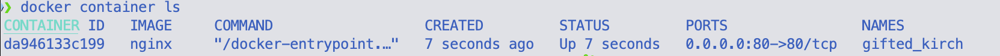
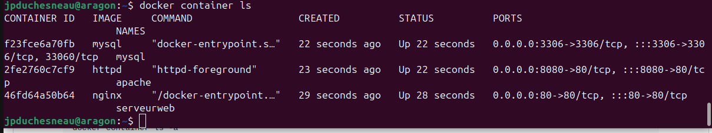

# Exercice 7 - Docker : Prise en main des conteneurs docker

### Informations
- Évaluation : formative.
- Type de travail : individuel.
- Durée : 2 heures.
- Système d'exploitation : Linux client, Linux serveur ou Windows.

### Objectifs

- Effectuer des tâches de gestion du système d’exploitation.
- Création correcte des comptes et des groupes d’utilisateurs.
- Attribution correcte des droits d’accès.
- Gestion appropriée des processus, de la mémoire et de l’espace disque.
- Localiser l'emplacement et la taille du noyau (kernel) Linux.
- Localiser les modules associés au noyau de Linux.
- Vérifier les modules chargés en mémoire.
- Localiser les fichiers sources de Linux.
- Utiliser des commandes d'administration système.


## Préambule - Installation

- Sous Windows  
	- [Docker Destop](https://docs.docker.com/desktop/install/windows-install/).  
	- [Intégration à WSL](https://docs.docker.com/desktop/windows/wsl/).
- Sous Linux : voir l'exercice 1.  
- [Sous MAC](https://docs.docker.com/desktop/install/mac-install/). 
  
<details>
    <summary>Docker et WSL ?</summary>
Depuis la version 2.2.0.3 de Docker Desktop pour Windows, Docker offre la possibilité d’utiliser WSL2 (Windows Subsystem for Linux 2) afin d’éviter l’obligation de créer une machine virtuelle dans Hyper-V. Avant de pouvoir dire à Docker d’utiliser ce système, il est nécessaire de configurer Windows pour activer WSL2.
La version minimum de Windows 10 pour utiliser WSL 2 est Windows 10 Build 18917.

</details>


## Section 1 - Premier conteneur

### Vérification de l'installation de Docker

Vous allez vérifier le bon fonctionnement de votre installation de Docker.

À partir d’une ligne de commande, vérifier la version de Docker.

```bash
docker version
```

Quelle est la version de votre Docker ?
<details>
  <summary markdown="span">Réponse.</summary>
	La réponse varie.
</details>

Vous pouvez vérifier les paramètres de la configuration de l’engin Docker.

```bash
docker info
```

Pour connaître les commandes disponibles de Docker, entrer la commande <code>docker</code> suivie de <code>Enter</code>.

Si vous remonter la liste, vous allez trouver la section _Management Commands_.  

Le format d’une commande Docker est :

```bash
docker <management_command> <command> (options)
```

L’ancienne méthode, qui fonctionne encore, était :

```bash
docker <command> (options)
```

Par exemple, si vous voulez lancer un conteneur :

```bash
docker container run (option)
```

Votre première image sera l’image du serveur Web Nginx. Le registre par défaut d’images de Docker est docker hub ([hub.docker.com](https://hub.docker.com)).

Pour lancer votre premier conteneur, exécuter la commande suivante :

```bash
docker container run --publish 80:80 nginx
```

L’utilisation de la commande <code>docker container run</code> :

1.	Recherche l’image nginx localement dans le cache d'images, ne la trouve pas.
2.	Recherche ensuite dans le registre d'images distant (par défaut Docker Hub).
3.	Télécharge la dernière version (nginx:latest par défaut).
4.	Crée un nouveau conteneur basé sur cette image et se prépare à le lancer.
5.	Lui donne une adresse IP virtuelle sur un réseau privé à l'intérieur de l’engin docker.
6.	Ouvre le port 80 sur l'hôte et transfère au port 80 dans le conteneur.
7.	Démarre le conteneur en utilisant la commande spécifiée (à voir plus loin).

Ouvrez un navigateur et entrée localhost (ou 127.0.0.1) à la barre d’adresses.  

Qu’avez-vous reçu ?
<details>
  <summary markdown="span">Réponse.</summary>
	La page par défaut du serveur Web Nginx.
</details>

Pour arrêter le conteneur, faites <code>Ctrl-c</code> à la fenêtre de commande.  

**Attention :** dans Windows, il se peut que le conteneur continue de s’exécuter en arrière-plan. Après le <code>Ctrl-c</code>, vous devez faire la commande <code>docker container stop <conteneur id/name></code>, nous allons voir cette commande plus en détail plus loin.

Nous allons changer la commande pour nous permettre de reprendre contrôle de la ligne de commande.

```bash
docker container run --publish 80:80 --detach nginx
```

Vérifier sur votre navigateur que le conteneur s’exécute.

Pour vérifier les conteneurs qui s’exécutent, exécuter la commande :

```bash
docker container ls
```



Chaque conteneur a un ID et un nom (NAMES). Si l’on ne spécifie pas de nom, un nom au hasard est utilisé. L’ID et le nom doivent être uniques pour tous nos conteneurs.  

La colonne PORTS indique que toutes nos adresses IP sont reliées au port 80 qui est redirigé au port 80 TCP du conteneur.  

Pour arrêter le conteneur, exécuter la commande : 

```bash
docker container stop container_id
```

**Remarque :** vous devez entrer juste assez de caractères de l’ID pour le rendre unique.  

Vérifier que le conteneur est arrêté :

```bash
docker container ls
```

Cette commande affiche les conteneurs qui s’exécutent.

Pour afficher tous les conteneurs, exécuter la commande :

```bash
docker container ls -a
```

Avez-vous seulement un conteneur ?
<details>
  <summary markdown="span">Réponse.</summary>
	Non, plusieurs. Tant que vous n'avez pas effacé votre conteneur <code>docker container rm ...</code>, il reste présent sur la machine.
</details>


À chaque fois que vous exécutez la commande <code>docker container run</code>, un nouveau conteneur est lancé.  

Lancer à nouveau le conteneur, mais en spécifiant un nom :

```bash
docker container run --publish 80:80 --detach --name serveurweb nginx
```

Vérifier vos conteneurs avec la commande : <code>docker container ls -a</code>  

Avez-vous un nouveau conteneur ? Si oui, quel est son nom ?
<details>
  <summary markdown="span">Réponse.</summary>
	Oui, serveurweb.
</details>

Utiliser un navigateur pour vérifier que le conteneur Nginx s’exécute. Rafraichir la page de votre navigateur quelques fois.  

Avant de « détacher » votre conteneur, les journaux s’affichaient à l’écran, mais plus maintenant.  

Exécuter la commande suivant pour voir vos journaux :

```bash
docker container logs serveurweb
```

Ajouter le paramètre <code>--help</code> à la fin de la commande et indiquer le paramètre qui permet l’affichage suivant.  

Afficher les journaux en continu :
<details>
  <summary markdown="span">Réponse.</summary>
	
	-f

</details>

Afficher les journaux depuis un temps en particulier :
<details>
  <summary markdown="span">Réponse.</summary>

	--since

</details>

Afficher les 10 dernières lignes :  
<details>
  <summary markdown="span">Réponse.</summary>

	--tail 10

</details>

Exécuter la commande suivante pour afficher les processus qui s’exécutent dans le conteneur.

```bash
docker container top serveurweb
```

Affichez tous les conteneurs et prenez en note les trois premiers caractères de l’ID de chacun.  

La commande pour effacer des conteneurs est docker container <code>rm ID</code>. (ID doit contenir assez de caractère pour le rendre unique.)  

Utiliser la commande suivante pour effacer tous vos conteneurs.

```bash
docker container rm ID1 ID2 ID3
```

Avez-vous réussi à effacer tous les conteneurs ?
<details>
  <summary markdown="span">Réponse.</summary>
	Non.
</details>

Normalement, un conteneur doit être arrêté pour pouvoir l’effacer.

Utiliser la commande suivante pour forcer à effacer le conteneur qui s’exécute toujours.

```bash
docker container rm -f ID
```

- Un petit truc pour supprimer tous les conteneurs (Linux ou Git Bash sur Windows) :
 
	```bash
	docker container stop $(docker ps -a -q)
	docker container rm $(docker ps -a -q)
	# ou
	docker container rm -f $(docker ps -a -q)
	``` 


Vérifier que les conteneurs sont effacés : <code>docker container ls -a</code>.

Voici un bref résumé de la commande <code>docker container run</code>.  


## Section 2 - gestion de plusieurs conteneurs

Dans cette partie, vous allez lancer par vous-même plusieurs conteneurs.  

Je vous recommande de consulter le site Web [docs.docker.com](https://docs.docker.com).  

Utiliser le paramètre <code>--help</code> pour vous aider dans les commandes Docker.  

### Votre travail
1.	Vous devez lancer les serveurs nginx, mysql et httpd (apache).
2.	Les conteneurs doivent être « détachés » : utiliser <code>--detach</code> (ou `-d`).
3.	Vous devez nommer vos conteneurs (<code>--name</code>).
4.	Pour les ports d’écoute : nginx devrait écouter sur 80:80, httpd sur 8080:80, mysql sur 3306:3306.
5.	Lors de l'exécution de mysql, utilisez l'option <code>--env</code> (ou `-e`) pour passer <code>MYSQL_RANDOM_ROOT_PASSWORD=yes</code>.
6.	Utilisez les journaux du conteneur mysql pour trouver le mot de passe aléatoire qu'il a créé au démarrage.
7.	Nettoyez tout avec les commandes <code>docker container stop</code> et <code>docker container rm</code> (les deux peuvent accepter plusieurs noms ou ID)
8.	Utilisez la commande <code>docker container ls</code> pour vous assurer que tout est correct avant et après le nettoyage.

<details>
  <summary markdown="span">Réponse.</summary>

	docker container run -p 80:80 --name serveurweb -d nginx
	docker container run -p 8080:80 --name apache -d httpd
	docker container run -d --name mysql -e MYSQL_RANDOM_ROOT_PASSWORD=yes -p 3306:3306 mysql
	docker container logs mysql | grep PASSWORD
	docker container ls
	curl localhost
	curl localhost:8080
	docker container ls
	docker container stop ...
	docker container ls -a
	docker container rm ...
	docker container ls -a
	docker image ls  
	
	
</details>


## Pour vérification
Remettre une capture démontrant vos 3 conteneurs s'exécutant.
  

## Références
[https://docs.docker.com/](https://docs.docker.com/)
