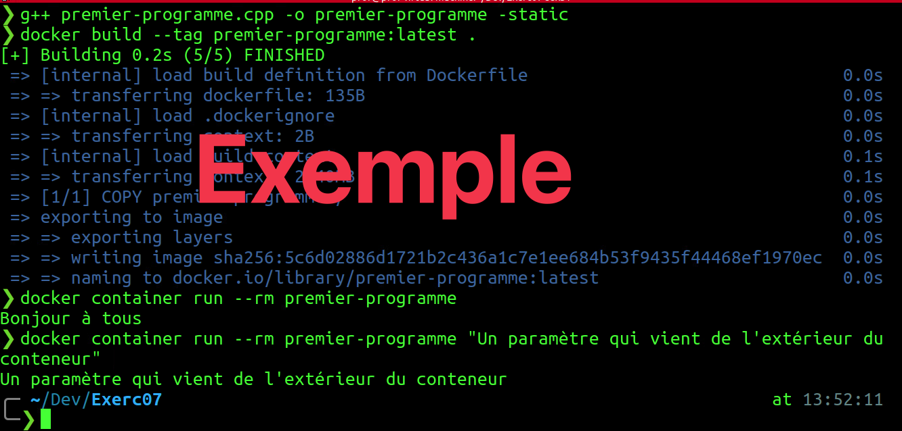

# Exercice 8 - Docker : image

- Évaluation : formative
- Durée estimée : 2 heures
- Système d'exploitation : Ubuntu Client 
- Environnement : docker

### Objectifs  

- Analyser les différents scénarios de déploiement proposés dans les documents de conception.  
- Distinguer les services à installer sur les serveurs.  
- Distinguer les services à installer sur le réseau.  
- Déterminer les étapes à entreprendre pour installer et configurer les services réseau. 

## Section 1 - Créez le programme hello-world

- Sous Windows : lancez une console Ubuntu.
- Sous Linux, lancer un terminal.
- Vérifiez si le programme g++ est installé (g++ --help)
- S'il n'est pas installé, l'installer (package g++)

	<details>
	    <summary>Installation de g++</summary>
	
	```bash
	sudo apt update && sudo apt install g++ -y
	```
	Si vous avez des problèmes avec l'installation de g++ : <https://stackoverflow.com/questions/66869441/unable-to-install-g-and-build-essentials-in-ubuntu-20-04>.
	</details>
	
- Créez le fichier "premier-programme.cpp" avec le contenu suivant :

```cpp
#include <iostream>

int main(int argc, char** argv) {
    std::cout << "Bonjour à tous" << std::endl;
}
```

- Pour compiler votre programme, utilisez la commande <code>g++ premier-programme.cpp -o premier-programme -static</code>.

- Créez dans le même répertoire que votre fichier "premier-programme" précédemment compilé, le fichier "Dockerfile" avec le contenu suivant :
  
  ```dockerfile
  FROM scratch
  COPY premier-programme /
  ENTRYPOINT ["/premier-programme"]
  ```

- À partir du fichier et de la documentation, décrivez ce que fait le fichier Dockerfile
- Tapez la commande <code>docker build --tag premier-programme:latest .</code>
- Vérifiez que l'image a bien été créée
- Lancez un conteneur qui utilise votre image

```bash
docker container run --rm premier-programme
```
- Modifiez le programme précédent pour qu'il corresponde au listage suivant (n'oubliez pas de compiler de nouveau) :

```cpp
#include <iostream>

int main(int argc, char** argv) {
    std::cout << argv[1] << std::endl;
}
```

- Modifiez votre Dockerfile afin que par défaut, le programme reçoive "!!Bonjour à tous !!" en paramètre.
    <details>
    <summary>Modification du Dockerfile </summary>
    
    ```Dockerfile
    FROM scratch
    COPY premier-programme /
    ENTRYPOINT ["/premier-programme"]
    cmd [ "Bonjour à tous" ]
    ``` 
    
    </details>  
    
- Reconstruisez votre image de conteneur
- Essayez de lancer un nouveau conteneur en utilisant les mêmes lignes de commandes que précédemment.
- Essayez de lancer un nouveau conteneur en utilisant en ajoutant à la fin la chaîne de caractères <code>"Un paramètre qui vient de l'extérieur du conteneur"</code>.

## Pour vérification
Remettre une capture d’écran de la dernière création et du dernier test de l'image.  



## Section 2 - Créer une image à partir d'une autre image
Une image est construite à partir d’un fichier <code>Dockerfile</code> : si vous voulez utiliser un autre nom de fichier, vous devez utiliser la commande :

```bash
docker build -f un_fichier_dockerfile
```

- Consultez le Dockerfile de nginx : <https://github.com/nginxinc/docker-nginx/blob/ef8e9912a2de9b51ce9d1f79a5c047eb48b05fc1/mainline/debian/Dockerfile>
- Consultez le site <https://docs.docker.com/engine/reference/builder/> pour comprendre les commandes <code>FROM, ENV, RUN, EXPOSE, ENTRYPOINT, CMD</code>. Vous pouvez constater que nginx s'exécute à partir d'une image Debian minimale. 

	Quelle est la différence entre ENTRYPOINT et CMD ?
	
	<details>
	<summary>Réponse</summary>
	[The Difference Between CMD and ENTRYPOINT in Docker Images](https://www.howtogeek.com/devops/the-difference-between-cmd-and-entrypoint-in-docker-images/)
	</details>

- Créez un répertoire de travail : par exemple <code>Docker</code>.
- Dézipper le fichier [dockerfile-exemple.zip](extra/dockerfile-exemple.zip) dans votre répertoire de travail.
- Allez dans le répertoire <code>dockerfile-exemple</code>. Ouvrez le fichier <code>Dockerfile</code>. Le fichier <code>index.html</code> va nous servir « d’application » à intégrer dans notre serveur nginx.
- Voici ce que fait le <code>Dockerfile</code> :
	- Nous allons utiliser une image officielle (la commande <code>FROM</code>). On peut utiliser une image officielle comme image de départ, c’est même recommandé et ça rend notre tâche beaucoup plus simple.
	- Par la suite, nous allons nous placer dans le répertoire <code>/usr/share/nginx/html</code> (la commande <code>WORKDIR</code>, nous aurions également pu utiliser la commande <code>RUN</code> avec <code>cd</code>).
	- Finalement, nous allons copier le fichier <code>index.html</code> de notre répertoire hôte dans le répertoire <code>/usr/share/nginx/html</code> de notre conteneur : on n’inclut pas le chemin (path), car nous sommes déjà dans le répertoire.
	- On n'a pas à spécifier <code>EXPOSE</code> pour les ports ou <code>CMD</code> car ils sont dans l'image initiale incluse avec la commande <code>FROM</code>. De là l’avantage d’utiliser une image existante.
- Exécutez la commande pour construire votre image et exécuter un conteneur (le <code>-t</code> ajoute un tag à notre image, il y a un point à la fin).

```bash
docker image build -t monimage .
docker container run -p 8080:80 --rm monimage
```
- Ouvrez un navigateur à localhost:8080.
- Votre fichier index s’affiche-t-il ? (Si vous avez la page de nginx, vous pouvez essayer de rafraichir la page ou de vider l'historique de votre navigateur).  
- Faites la commande <code>Ctrl-c</code> pour arrêter votre conteneur.
- Vérifier les images de votre hôte pour voir que votre nouvelle image s’y trouve.

## Section 3 - Un peu de nettoyage
Les images et les conteneurs que vous utilisez prennent de l’espace sur votre disque, il faut donc quelques fois faire un peu de ménage.  
Vous pouvez utiliser les commandes <code>prune</code> pour nettoyer les images, les volumes, les espaces tampons et les conteneurs.  
Par exemple, pour nettoyer les images « pendantes » :

```bash
docker image prune
```
Ou, pour tout nettoyer :

```bash
docker system prune  
```

Pour nettoyer toutes les images non utilisées :
```bash
docker image prune -a
```

- Nettoyez les images non utilisées de votre système.
- Utilisez la commande suivante pour voir l'utilisation de l'espace par Docker :

```bash
docker system df
```

N'oubliez pas que chacune de ces commandes a des options que vous découvrez avec <code>--help</code>.  
Par contre, ayant un compte Docker gratuit vous êtes limité au nombre de téléchargements d’images que vous pouvez faire en 6 heures : <https://docs.docker.com/docker-hub/download-rate-limit/>. Vous devez donc bien balancer la gestion de votre espace local et le téléchargement de nouvelles images.


## Références
<https://docs.docker.com/engine/reference/builder/>  
<https://www.howtogeek.com/devops/the-difference-between-cmd-and-entrypoint-in-docker-images/>  
<https://docs.docker.com/docker-hub/download-rate-limit/>