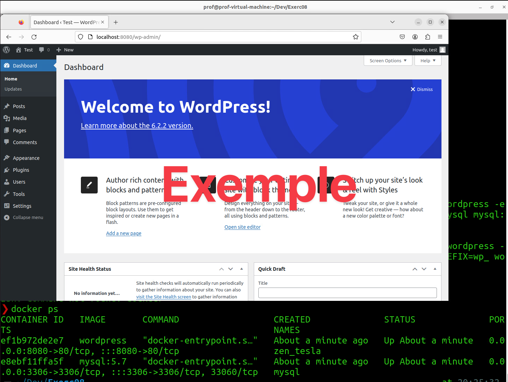

# Exercice 9 - Docker, volume et stockage

### Informations
- Évaluation : formative.
- Durée estimée : 4 heures.
- Système d'exploitation : Ubuntu client 22.04 ou Windows.
- Environnement : Docker.  


## Attention :
Vous devez créer une machine depuis le modèle Tmp_Ubuntu2204_iss
- Bouton droit sur la VM est créer une VM à partir du model.
- Le mot de passe de l'usager Etudiant_vm est **X8owPSTV**

### Objectifs  

- Analyser les différents scénarios de déploiement proposés dans les documents de conception.  
- Distinguer les services à installer sur les serveurs.  
- Distinguer les services à installer sur le réseau.  
- Déterminer les étapes à entreprendre pour installer et configurer les services réseau. 

Note : je vous recommande de vous créer un répertoire de travail nommé Exercice08.

## Section 1 - Busybox

### Section 1.1 - Réseau par défaut (bridge)

- Ouvrez **deux** terminaux, powershell ou bash, et sur chacun, lancez un conteneur de l'image "busybox" en mode interactif.

```bash
docker container run -it --rm --name busy1 busybox
```

- Trouvez l'adresse IP de chaque conteneur.

	<details>
	<summary>Quelle commande ?</summary>
	
		ip -4 address
	
	</details>

- Effectuez une requête ICMP echo request (ping) d'un conteneur vers l'autre. Qu'observez-vous ?

	<details>
	<summary>Réponse.</summary>
	Ils peuvent communiquer à l'intérieur de Docker.
	</details>


- Essayez de faire une requête ICMP echo request vers "www.google.com". Qu'observez-vous ?

	<details>
	<summary>Réponse.</summary>
	Ils peuvent communiquer à l'extérieur.
	</details>

- Quittez les conteneurs.
- Nettoyez vos conteneurs en supprimant, si nécessaire, ceux créés dans cette section.

### Section 1.2 - Réseau none

- Lancez un conteneur, en mode intéractif, de l'image "busybox" avec l'option "<code>--network none</code>"

	<details>
	<summary>La commande.</summary>
		
		docker container run --rm --network none -it --rm busybox
	
	</details>


- Essayez de déduire l'adresse IP du conteneur. Qu'observez-vous ?

	<details>
	<summary>Réponse.</summary>
	Il n'y a pas d'adresse. Il n'y a même pas d'interface réseau.
	</details>

- Essayez de faire une requête ICMP echo request vers "www.google.com". Qu'observez-vous ?

	<details>
	<summary>Réponse.</summary>
	Ce n'est pas possible, car nous ne sommes pas reliés à un réseau.
	</details>
	
- Nettoyez votre conteneur en supprimant, si nécessaire, celui créé dans cette section.

### Section 1.3 - Réseau host ([Linux seulement](https://docs.docker.com/network/host/))

- Lancez un conteneur, en mode intéractif, de l'image "busybox" avec l'option <code>--network host</code>.
- Essayez de déduire l'adresse IP du conteneur. Qu'observez-vous ?

	<details>
	<summary>Réponse.</summary>
	Vous avez reçu une adresse dans le même réseau que votre hôte.
	</details>

- Essayez de faire une requête ICMP echo request vers "www.google.com". Qu'observez-vous ?

	<details>
	<summary>Réponse.</summary>
	Vous pouvez communiquer à l'extérieur.
	</details>
	
- Nettoyez votre conteneur en supprimant, si nécessaire, celui créé dans cette partie.

**Note :** pour les utilisateurs de Docker Desktop sous MAC ou Windows, la commande va fonctionner, mais comme vous êtes dans une VM vous allez être connecté au réseau de l'hyperviseur. Donc, vous ne recevrez pas une adresse de votre réseau.

## Section 2 - Nginx - réseau

Dans cette section, vous allez devoir utiliser l'image du serveur Web nginx afin de créer un serveur web ([Documentation Nginx](https://hub.docker.com/_/nginx)).

### Section 2.1 - Nginx - premiers tests

- Sur un premier terminal, lancez en arrière-plan (<code>-d</code>) l'image "nginx" sans spécifier de redirection de port avec le nom "mon_nginx" (<code>--name</code>).
- Faite la commande <code>docker container inspect mon_nginx</code> afin de trouver l'adresse du conteneur.
- Sur un autre terminal, lancez l'image "browsh/browsh" en mode intéractif (<code>-it</code>) ([Documentation browsh/browsh](https://hub.docker.com/r/browsh/browsh)).
- Faites un <code>Ctrl-l</code> et tapez l'adresse IP de votre serveur web. Le site par défaut d'Nginx devrait s'afficher. Pour quitter faites <code>Ctrl-q</code> (pour les autres commandes faites <code>F1</code>).
- À partir de votre navigateur favori, essayer d'ouvrir une page Web à l'adresse IP de votre conteneur nginx. Essayez avec l'adresse locale : `localhost`.

	<details>
	<summary>Qu'observez-vous et pourquoi ?</summary>
	Il n'est pas possible d'accéder au serveur Web nginx. Nous n'avons pas créé de lien vers le monde extérieur de Docker. Le conteneur est seulement  accessible par les autres conteneurs de Docker qui sont dans le même réseau Docker.
	</details>
- Nettoyez vos conteneurs en supprimant ceux créés dans cette section.

### Section 2.2 - Nginx - liaison

- Recréé un conteneur, mais cette fois-ci, faites une liaison entre le port 1234 de l'hôte vers le port 80 du conteneur.
- Refaites les tests de la partie précédente (utiliser http://localhost:1234 pour le navigateur local).
- Nettoyez vos conteneurs en supprimant ceux créés dans cette partie.

## Section 3 - Ngnix - volume

- Créez vous un répertoire de travail temporaire et créez un fichier <code>index.html</code>. Dans ce fichier, écrivez un code html simple afin d'afficher "Un fichier de mon hôte servi à partir d'un conteneur"
- Par défaut, l'image "Nginx" utilise le répertoire <code>/usr/share/nginx/html</code> comme base de recherche de ses fichiers statiques. Vous allez devoir créer un point de montage (bind mount) afin que votre répertoire soit monté vers ce chemin au moment du démarrage du conteneur (consultez la partie "Hosting some simple static content" de la documentation [Documentation Nginx](https://hub.docker.com/_/nginx)). Vous devez également faire une liaison entre le port 1234 de l'hôte vers le port 80 du conteneur.
	- Pour spécifier le chemin (path) de l’hôte, nous pouvons écrire le chemin complet ou nous pouvons utiliser la variable shell <code>$(pwd)</code>.
	- Remarque : pour PowerShell utiliser <code>${pwd}</code> et pour cmd.exe utiliser <code>%cd%</code>.

	<details>
	<summary>Commande.</summary>
		
		docker run --name some-nginx -v $(pwd):/usr/share/nginx/html -d -p 1234:80 nginx  
	
	</details>
- Vérifiez que vous voyez bien votre page dans votre navigateur.
- Supprimez votre conteneur et lancez en un nouveau en faisant maintenant un montage en lecture seule (<code>:ro</code> comme dans la documentation de nginx).
- Vérifiez que le tout fonctionne toujours.
- Nettoyez vos conteneurs en supprimant celui créé dans cette partie.

## Section 4 - Application MVC core

### Section 4.1 - Création d'un projet MVC en .Net core

- Au besoin, procéder à l'installation : 
[Installing .NET 6 on Ubuntu 22.04 (Jammy)] (https://github.com/dotnet/core/issues/7699)


- À partir d'un terminal et de la commande dotnet, créez une application :

  - Type : mvc
  - Nom : webapp
- Modifiez le fichier "Views/Home/Index.cshtml" pour y ajouter votre prénom / nom.
- Testez que l'application fonctionne localement.

<details>
 <summary>Création de l'application MVC.</summary>

```bash
dotnet new mvc -au None -n webapp
cd webapp/
dotnet run
```
- Testez l'application localement: Ouvrez un navigateur avec localhost et le port mentionné pour le dotnet run. Quitter l'application avec Ctrl-c. 
</details>

### Section 4.2 - Création d'un compte docker hub

- Allez sur le site de docker hub et créez-vous un compte.
- Créez un dépôt nommé "webapp".

### Section 4.3 - Création d'une image

- Placez-vous à la racine du projet.
- Créez le fichier Dockerfile avec le contenu suivant :

```Dockerfile
FROM mcr.microsoft.com/dotnet/sdk:6.0 AS build-env
WORKDIR /app

COPY *.csproj ./
RUN dotnet restore

COPY . ./
RUN dotnet publish -c Release -o out

FROM mcr.microsoft.com/dotnet/aspnet:6.0
WORKDIR /app
COPY --from=build-env /app/out .
ENTRYPOINT ["dotnet", "webapp.dll"]
```

- Assurez-vous de bien comprendre chaque ligne du fichier Dockerfile.
- Construisez l'image "votreDockerId/webapp" avec la version "latest"

```bash 
docker build --tag votreDockerId/webapp:latest .
docker image ls
```
- Exécutez un conteneur à partir de cette image (vous devez spécifier votreDockerId/webapp pour votre image) en liant le port 80 du conteneur au port 5000 de l'hôte.
- Validez que le tout fonctionne (attention vous allez être en http).

### Section 4.4 - Publication

- Sur un terminal exécuter la commande <code>docker login</code> et tapez vos informations de connexion.
- Exécutez la commande <code>docker push votreDockerId/webapp:latest</code> (un exemple de la commande est disponible dans votre dépôt). La première fois que vous allez effectuer cette commande, si ce n'est pas déjà fait, il va vous demander vos informations de connexion.
- Allez dans votre compte sur docker hub et validez que votre image est bien présente.
- Supprimez votre image docker locale.
- Démarrez un conteneur à partir de l'image qui est sur docker hub et vérifiez que tout fonctionne. Docker devrait télécharger l'image de votre dépôt.
- Demandez le nom de l'image d'un de vos collègues ou utilisez mon image `clauderoy/webapp`.
- Démarrez un conteneur avec cette image et validez que tout fonctionne. 
- Nettoyez vos conteneurs en supprimant ceux créés dans cette section.

## Section 5 - MySQL

### Section 5.1 - MySQL - Base

- Si ce n'est déjà fait sur votre environnement docker, installez MySQL Workbench (https://dev.mysql.com/downloads/workbench/, choisir la bonne version pour votre Ubuntu).

```bash
cd ~/Downloads
sudo apt install ./mysql-workbench-community_8.0.31-1ubuntu22.04_amd64.deb
# Il se peut que vous ayez à faire
sudo apt --fix-broken install
```
- Lancez un conteneur à partir de l'image mysql (référence : [https://hub.docker.com/_/mysql](https://hub.docker.com/_/mysql)) :
  - Nom : mysql
  - Spécifiez que le conteneur doit être détaché (-d).
  - Fournissez la valeur "Passw0rd" pour la variable d'environnement "MYSQL\_ROOT\_PASSWORD" (Voir utilisation du -e dans la documentation).
  - Liez le port 3306 local vers le port 3306 du conteneur.

<details>
    <summary>Commande.</summary>

```bash
docker run -d --rm --name mysql -e MYSQL_ROOT_PASSWORD=Passw0rd -p 3306:3306 mysql
```

</details>

- Avec MySQL Workbench, validez que le tout marche :
  - Connectez-vous
  - Créez la base de données "test" (create database test;).
  - Validez que la base de données est bien existantes (show databases;)
- Arrêtez et supprimez le conteneur `mysql`.
- Recréez un nouveau conteneur mysql et connectez-vous de nouveau à MySQL et listez les bases de données. Que constatez-vous et pourquoi ?

	<details>
	    <summary>Réponse.</summary>
	    La base de données ne s'y trouve pas. Un nouveau conteneur utilise un nouveau volume. Il aurait fallu lier les conteneurs au même volume, créer précédemment.
	</details>

- Supprimez votre conteneur.

### Section 5.2 - MySQL - Volume

- Créez-vous un répertoire qui va contenir vos données pour MySQL.
- Réutilisez votre ligne de commande pour créer un conteneur MySQL avec les mêmes caractéristiques que précédemment et ajoutez le montage d'un volume qui lie le répertoire de données que vous venez de créer au répertoire "/var/lib/mysql".

<details>
    <summary>Commande.</summary>

```bash
docker run -d --rm --name mysql -e MYSQL_ROOT_PASSWORD=Passw0rd -p 3306:3306 -v $(pwd)/msyql:/var/lib/mysql mysql
```

</details>

- Avec MySQL Workbench, vérifiez que le tout marche :
  - Connectez-vous.
  - Créez la base de données "test" (create database test;).
  - Vérifiez que la base de données est bien existante (show databases;).
- Arrêtez et supprimez le conteneur "mysql".
- Recréez un nouveau conteneur mysql identique et connectez-vous de nouveau à MySQL et listez les bases de données. Que constatez-vous et pourquoi ?

	<details>
	    <summary>Réponse.</summary>
	    La base de données s'y trouve. Les deux conteneurs utilisent le même volume.
	</details>

- Supprimez votre conteneur.


## Section 6 - Wordpress - On fait parler plusieurs conteneurs ?

### Section 6.1 - Wordpress - Version manuelle

- Créez-vous un nouveau répertoire pour stocker une autre installation de bases de données.
- Créez un nouveau conteneur avec les options précédentes en modifiant le chemin du montage ainsi qu'en ajoutant les variables d'environnement suivantes :
  - MYSQL\_DATABASE=wordpress
  - MYSQL\_USER=wordpress
  - MYSQL\_ROOT\_PASSWORD=Passw0rd
  - MYSQL\_PASSWORD=Passw0rd
- Avec MySQL Workbench, essayez de vous connecter à la base de données wordpress avec le nom d'utilisateur "wordpress" et le mot de passe "Passw0rd".
- Cherchez l'adresse IP du conteneur mysql.
- Créez un conteneur à partir de l'image wordpress ([https://hub.docker.com/_/wordpress](https://hub.docker.com/_/wordpress)) en liant le port local 8080 au port 80 et avec les variables d'environnement suivantes :
  - WORDPRESS\_DB_HOST=172.17.0.2
  - WORDPRESS\_DB\_USER=wordpress
  - WORDPRESS\_DB\_PASSWORD=Passw0rd
  - WORDPRESS\_DB\_NAME=wordpress
  - WORDPRESS\_TABLE\_PREFIX=wp_
- Testez votre site web (localhost au port 8080) et vérifiez que ça fonctionne.
- Que pensez-vous de toutes ces manipulations ?

<details>
    <summary>Solution.</summary>

```bash
docker run -d --rm --name mysql -e MYSQL_ROOT_PASSWORD=Passw0rd -e MYSQL_DATABASE=wordpress -e MYSQL_USER=wordpress -e MYSQL_PASSWORD=Passw0rd -p 3306:3306 -v $(pwd)/msyql_wp:/var/lib/mysql mysql

docker run --rm --name wordpress -d -e WORDPRESS_DB_HOST=172.17.0.2 -e WORDPRESS_DB_USER=wordpress -e WORDPRESS_DB_PASSWORD=Passw0rd -e WORDPRESS_DB_NAME=wordpress -e WORDPRESS_TABLE_PREFIX=wp_ -p 8080:80 wordpress
```

</details>


## Pour vérification
Remettre une capture d’écran de votre site WordPress et du `ps` affichant votre conteneur s'exécutant.  



### Section 6.2 - Wordpress - Un début d'orchestration ?

- Lisez et exécutez les instructions présentes à la page suivante : [https://github.com/docker/awesome-compose/tree/master/official-documentation-samples/wordpress/](https://github.com/docker/awesome-compose/tree/master/official-documentation-samples/wordpress/)
	- Pour l'arrêter utiliser la commande <code>docker compose down</code>.
- Quels sont les avantages d'un tel système ?


