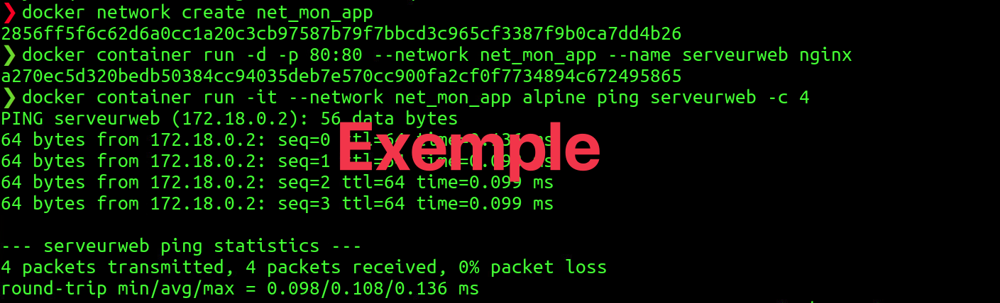

#  Exercice 11 :  DNS 

### Informations
- Évaluation : formative.
- Durée estimée : 2 heures.
- Système d'exploitation : Ubuntu client ou Windows.
- Environnement : Docker.  

### Objectifs  

- Comprendre le DNS.
- Comprendre le principe de DNS à l’intérieur de Docker.

Dans cet exercice, vous allez constater à quel point il peut être fastidieux de trouver une résolution d’adresse sans un serveur récursif. Heureusement, nous disposons d'un bon serveur DNS récursif, qui fait tout ce travail à notre place.

Un DNS récursif garde en mémoire ce qu'il trouve en effectuant cette recherche et s'en resservira pour d'éventuelles résolutions futures. Les serveurs « qui font autorité » (serveur du FQDN) indiquent une durée de validité pour les informations qu'ils donnent. Ainsi, les serveurs récursifs devront rafraichir le contenu de leur cache en fonction de dette durée de validité.

Vous allez également comprendre comment les conteneurs se « trouvent » dans Docker et comprendre que le DNS est la clé pour faciliter les communications entre conteneurs. Vous allez aussi découvrir comment ça fonctionne par défaut avec les réseaux personnalisés.

Vous avez vu que les conteneurs se retrouvent dans un réseau virtuel privé dans Docker et chacun des conteneurs se voient attribuer une adresse IP. Par contre, les conteneurs ne doivent pas compter sur les adresses IP pour l'intercommunication, car ces adresses peuvent changer. Docker possède un DNS intégré qui utilise les noms des conteneurs (il est également possible de créer des alias) comme enregistrement. Il est donc possible d’utiliser ce DNS dans vos réseaux personnalisés (le réseau « bridge » n’a pas de DNS).


## Section 1 : DNS et récursivité

### Étape 1 : sous Windows

Utilisez un poste Windows, soit votre propre ordinateur ou une VM, et répondez aux questions.

- Quel est le serveur de nom (DNS) pour votre poste client ?
	<details>
	<summary>Réponse</summary>
	Varie.
	</detail>

- Quelle commande avez-vous utilisée ? 
	<details>
	<summary>Réponse</summary>
	`nslookup`
	</detail>

- Faites un nslookup sur le nom de domaine : csfoy.ca

	Qui vous a répondu ? Est-ce que la réponse fait autorité (dépendant de votre version de Windows, il se peut que vous n'ayez pas l'information) ?
	<details>
	<summary>Réponse</summary>
	Votre serveur DNS.
	Si vous êtes à l'intérieur du cégep, oui. Sinon, non.
	</detail>

- Faites un nslookup sur le nom de domaine : gouv.qc.ca

	Qui vous a répondu ? Est-ce que la réponse fait autorité (dépendant de votre version de Windows, il se peut que vous n'ayez pas l'information) ? 
	<details>
	<summary>Réponse</summary>
	Votre serveur DNS.
	Non, elle n'est pas autorité.
	</detail>

- Essayer à nouveau avec un nslookup sur le nom de domaine : www.google.com

	Qui vous a répondu ? Est-ce que la réponse fait autorité (dépendant de votre version de Windows, il se peut que vous n'ayez pas l'information) ?
	<details>
	<summary>Réponse</summary>
	Votre serveur DNS.
	Non, elle n'est pas autoritée.
	</detail>

- À partir des expériences précédentes, à quel moment la réponse fait autorité ? 
	<details>
	<summary>Réponse</summary>
	La réponse fait autorité lorsque le serveur DNS qui nous répond est celui du FQDN.
	</detail>


### Étape 2 : sous Linux

- Utilisez la commande `nmcli` pour trouver les informations suivantes : 

|Informations	 sur l'interface	|
|:----------------------------|
|Nom de l’interface de sortie	|
|Adresse IP						|
|Masque							| 
|Passerelle						|
|**Configuration DNS**			|
|Serveurs							|
|Domaine							|
|Interfaces						|

- Exécutez la commande <code>cat /etc/hostname</code>. Quelle est l'utilité de ce fichier ?  

	<details>
	<summary>Réponse</summary>
	Il contient le nom de l'hôte.
	</details>

- Exécutez la commande : <code>cat /etc/hosts</code>. Quelle est l'utilité de ce fichier ? 

	<details>
	<summary>Réponse</summary>
	Il permet de faire une correspondance entre un nom d'hôte et une adresse IP. Dans le processus DNS, c'est le premier fichier consulté.
	</details>

- Exécutez la commande `nslookup` et puis entrer `localhost` et `Enter`. 
Quel est le serveur de nom (DNS) pour votre hôte ?

	<details>
	<summary>Réponse</summary>
	Le serveur est l'hôte local, 127.0.0.53, au port 53, le service systemd-resolved.
	</details>

- À partir de `nslookup` recherchez le nom de domaine `csfoy.ca` 

	Qui vous a répondu ? Est-ce que la réponse fait autorité ? 

	<details>
	<summary>Réponse</summary>
	La réponse peut varier dépendant si vous êtes directement sur le réseau du cégep, dans une VM...
	</details>

- Encore à partir de `nslookup`, rechercher le nom de domaine `gouv.qc.ca`.  

	Qui vous a répondu ? Est-ce que la réponse fait autorité ? 

	<details>
	<summary>Réponse</summary>
	Un des serveurs du gouvernement. Essayez d'entrer l'adresse IP reçu dans `nslookup`. Dans mon cas l'adresse était 142.213.160.134 et le serveur citizens.gov.qc.ca.  
	La réponse ne fait pas autorité.
	</details>

- Quittez `nslookup` (la commande exit) et exécutez maintenant la commande 
<code>host csfoy.ca</code>.

	La réponse est-elle la même qu'avec la commande nslookup ?

	<details>
	<summary>Réponse</summary>
	L'adresse IP est la même.
	</details>

- Ajoutez maintenant l'option -v (<code>host -v csfoy.ca</code>).

	Quelle est la différence ?

	<details>
	<summary>Réponse</summary>
	Nous avons beaucoup plus de détails sur la configuration du serveur DNS du domaine csfoy.ca.
	</details>

- Exécutez maintenant la commande <code>host -v www.csfoy.ca</code>.

	Que remarquez-vous de différent ? De quel type d'enregistrement est-il question ? Où pointe-t-elle ?
	
	<details>
	<summary>Réponse</summary>
	Nous avons l'information de l'entrée www.csfoy.ca d'ajoutée.  
	C'est un enregistrement de type A : nom vers une adresse IPv4.  
	Elle pointe vers la même adresse IP que csfoy.ca.
	</details>
	
Notre serveur DNS, fait une recherche récursive pour trouver l'information de www.csfoy.ca. Vous allez reproduire ce cheminement avec la commande `host`.


- Nous allons utiliser l'outil `host` pour chercher à résoudre le FQDN www.csfoy.ca non plus en posant la question à notre serveur DNS récursif, mais en partant d'un serveur racine d'Internet (le serveur j.root-server avec l'adresse IP 192.58.128.30), en utilisant la commande comme ceci :

	```bash
	host -v www.csfoy.ca 192.58.128.30|less
	# Pressez sur q pour sortir du less.
	```

- Le serveur `j-root-servers.net` ne nous réponds pas directement, comme nous pouvions nous en douter. En revanche, il nous envoie la liste des serveurs DNS compétents dans le TLD `ca`. Reposons donc la question au premier de la liste :

	```bash
	host -v www.csfoy.ca 185.159.196.2 
	```

	(Attention : Utilisez l'adresse IP de votre écran et non celles données ici. Elle peut être la même adresse)

	Qui fait autorité pour le domaine du Cégep ?

	<details>
	<summary>Réponse</summary>
	Plusieurs serveurs font autorité sur le domaine du cégep. Vous avez des serveurs du RISQ, car le cégep est associé avec le RISQ.  
	Vous pouvez également remarquer que ceux du cégep utilisent encore l'ancien nom de domaine.
	</details>

- Essayer de refaire le cheminement à partir d'un serveur racine de votre choix 
(voir le liste à [https://www.root-servers.org/](https://www.root-servers.org/) ) avec un domaine possédant un TLD (Top Level Domain) différent.


Et voilà le travail. Nous pouvons constater à quel point il peut être fastidieux de trouver une résolution d’adresse sans un serveur récursif. Heureusement, nous disposons d'un bon serveur DNS récursif, qui fait tout ce travail à notre place. Car c'est exactement de cette manière qu'il s'y prend pour nous obtenir la réponse.

Un DNS récursif garde en mémoire qu'il trouve en effectuant cette recherche et s'en resservira pour d'éventuelles résolutions futures. Les serveurs « qui font autorité » indiquent une durée de validité pour les informations qu'ils donnent. Ainsi, les serveurs récursifs devront rafraichir le contenu de leur cache en fonction de cette durée de validité. 


## Section 2 : DNS sous Docker

Dans cette section, vous allez essayer de comprendre la communication entre conteneurs avec le DNS interne de Docker.

### Étape 1 : communication dans le réseau bridge

- Lancez un conteneur nginx.

	```bash
	docker container run -d -p 80:80 --name serveurweb nginx
	```

- Trouvez l'adresse IP du conteneur.

	```bash
	docker container inspect serveurweb | grep IPAddress
	```

- Nous allons essayer de pigner l'adresse IP et le nom du conteneur. Pour ce faire, nous allons utiliser un conteneur `Alpine`.

	```bash
	docker container run -it alpine ping AdresseIP_serveurweb -c 4
	docker container run -it alpine ping serveurweb -c 4
	```
	
	Avez-vous réussi à pigner avec le nom du conteneur ?

	<details>
	<summary>Réponse</summary>
	Non, seulement avec l'adresse IP. Le serveur DNS de Docker n'est pas fonctionnel dans le réseau bridge.
	</details>

- Quittez et effacez votre conteneur.

	```bash
	docker container rm -f serveurweb
	```
	
### Étape 2 : communication dans un réseau privé virtuel

- Nous allons maintenant créer un réseau privé virtuel et relier le conteneur à ce réseau.

	```bash
	docker network create net_mon_app
	docker container run -d -p 80:80 --name serveurweb --network net_mon_app nginx
	```

- Vérifiez que tout est fonctionnel.

	```bash
	docker network ls
	docker container ls
	docker network inspect net_mon_app
	```

- Vous allez pigner le conteneur `serveurweb` avec un conteneur `alpine` dans le même réseau.

	```bash
	docker container run -it --network net_mon_app alpine ping serveurweb -c 4
	```

	Avez-vous réussi à pigner avec le nom du conteneur ?

	<details>
	<summary>Réponse</summary>
	Oui, le serveur DNS de Docker est fonctionnel dans notre réseau privé.
	</details>


Vous pouvez constater que la résolution DNS fonctionne.


## Pour vérification

Remettre une capture d’écran qui inclus la création de votre réseau privé virtuel, le lancement de votre conteneur dans le réseau privé virtuel et le conteneur alpine qui ping le nom du conteneur dans l'espace travaux, sur LÉA.

