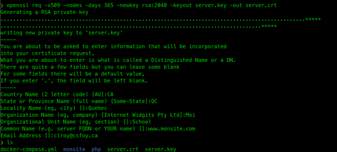

#  Exercice 13 :  Apache, modules et SSL

### Informations
- Évaluation : formative.
- Type de travail : individuel
- Durée estimée : 3 heures.
- Système d'exploitation : Ubuntu client.
- Environnement : Docker.  

### Objectifs  

-	Lancer un conteneur Apache personnalisé
-	Faire une configuration avancée : modules et SSL.

Dans cet exercice, vous allez lancer un conteneur Apache personnalisé, installer des modules Apache et créer un site Web sécurisé.


## Section 1 : Installation d'Apache
Dans cette partie, vous allez installer le serveur Web Apache selon les spécifications données.

### Étape 1 : Docker-compose

Nous allons utiliser docker-compose pour se créer un conteneur Apache personnalisé. Voici les caractéristiques de ce que nous voulons accomplir :
- Remplacer le fichier de configuration httpd.conf par le nôtre.
- Créer un répertoire /srv/htdocs.
- Créer un point de montage du répertoire actuel au répertoire /srv/htdocs.
  
**ATTENTION :Sauf si on vous le précise, vous travaillerez toujours à partir de /home/$user/Dev/Sites.**
- Installez les logiciels nano (ou vim) et iproute (pour vérification réseau).

**Notes** : la modification du répertoire de document Web par défaut pour /srv/htdocs est seulement pour l’aspect éducatif de l’exercice.

Docker-compose nous permet de sauvegarder nos informations d’exécution de notre conteneur dans un fichier facile à lire (yaml). Docker-compose n’est pas un outil de production, mais parfait pour faire du développement local ou pour faire des tests. 

#### Installation de docker-compose

Avant d'aller plus loin, vérifier si vous avez la bonne version de docker-compose.
Pour ce faire, faites-la commande suivante :|
```bash
docker-compose --version
```
Vous devez avoir la version 2.4.29 ou plus.
Si ce n'est pas le cas, vous pouvez l'installer avec les commandes suivantes :
```bash
# Nous récupérons docker-compose depuis GitHub.
 curl -SL https://github.com/docker/compose/releases/download/v2.29.2/docker-compose-linux-x86_64 -o /usr/local/bin/docker-compose

# Ajout d'un lien symbolique dans nos binaire pour qu'il puisse être exécuté
 sudo ln -s /usr/local/bin/docker-compose /usr/bin/docker-compose
```

Vérifier à nouveau sa version, faites-la comme suivante :|
```bash
docker-compose --version
```
Vous devriez maintenant avoir la version 2.4.29
#### Syntaxe du fichier docker-compose.yml
voici des informations sur la syntaxe d’un fichier docker-compose.yml.
```yaml
version: '3.8'  # si aucune version n'est spécifiée, alors v1.
                # Minimum v2 recommandé

services:  # conteneurs. Identique à docker run
  servicename: # un nom convivial.
# C'est aussi le nom DNS à l'intérieur du réseau
    image: # facultatif si vous utilisez build:
    command: # facultatif, remplace le CMD par défaut spécifié
 # par l'image
    environment: # facultatif, identique à -e dans l'exécution du docker
    volumes: 	  # facultatif, identique à -v dans l'exécution du docker
   
  servicename2:

volumes:  # facultatif, identique à docker volume create
networks: # facultatif, identique à docker network create

```
Docker-compose facilite grandement le développement. Par exemple, si votre projet à un Dockerfile et un docker-compose.yml, vous pouvez lancer votre projet avec :
```bash
git clone github.com/$user/MonLogiciel
# Faire un clone du projet depuis votre github
# Démarrer le projet
docker-compose up
```

## Mise en place du projet
Nous allons commencer par reproduire la commande de l’exercice précédent. Dans le répertoire Sites, créer un fichier docker-compose.yml avec les instructions suivantes à l’intérieur.
```yaml
version: "3"

services:
  my-apache-app:
    image: httpd # utilise l’image la plus récente
    ports:
      - '8080:80' # exposer 8080 sur l'hôte et l’envoyé à 80 dans le conteneur
    volumes:
      - .:/usr/local/apache2/htdocs/ # lien avec le répertoire de Apache
```

### Vérification de l'installation


Lancez votre conteneur et vérifiez que ça fonctionne en allant au site Web http://www.monsite.com:8080. La commande pour lancer le conteur est :
- Vérifiez que votre image s’exécute bien.
```bash
docker-compose up -d
```
Voici d’autres commandes que vous pouvez utiliser.
```bash
docker-compose logs
docker-compose --help
docker-compose ps
docker-compose top

```
Arrêter votre conteneur.
```bash
docker-compose down
```

Pour rappel, la commande va tout démonter et supprimer entièrement les conteneurs utilisés.

### Restructuration du projet

Nous allons restructurer notre environnement dans le but qu’elle soit davantage évolutive : 
- Dans votre répertoire Sites, créer un répertoire monsite. 
- Dans le répertoire monsite, créer un répertoire conf et y copier le fichier httpd.conf récupéré dans l’exercice précédent. 
- Créer également un répertoire html et y déplacer le fichier index.html créé dans l’exercice précédent.

```bash
  /home/$user/Dev/Sites/
                  |--monsite/
                    |conf/
                      |-- httpd.conf
                    |html/
                      |-- index.html
             
```


- Maintenant, nous allons créer une image qui répond à notre demande. Dans le répertoire Sites, créer un fichier Dockerfile avec les informations suivantes : 

```yaml
# Contenu du fichier
# Creer une image pour notre serveur Apache

FROM httpd:latest
# Utilise image officiel

RUN apt-get update \
    && apt-get install -y nano iproute2
# Install nano et iproute pour utiliser la commande ss

RUN mkdir /srv/htdocs
# Ajouter le repertoire pour les documents HTML (Directive DocumentRoot)

EXPOSE 80 443
# Exposer les ports 80 et 443

WORKDIR /usr/local/apache2/conf
# Change dans le repertoire de configuration

COPY ./monsite/conf/httpd.conf httpd.conf
# Remplacer httpd.conf par celui présent sur dans mon espace de développement.
```

- Maintenant, nous allons construire l'image du Dockerfile : 

```bash
docker image build -t monhttpd .
```
- Tester votre image.
```bash
docker run -d --name my-apache-app -p 8080:80 -v "$(pwd)"/monsite/html:/srv/htdocs monhttpd
```
- Ouvrez un navigateur et allez au site Web http://www.monsite.com:8080.
- Sinon dépanner, si oui :
- Entrez dans votre image et vérifiez si les logiciels sont bien installés.
```bash
docker container exec -it my-apache-app bash
ss -tnap
exit
```
Arrêter votre conteneur et l’enlever.
```bash
docker container rm -f my-apache-app
```

- Modifier le fichier httpd.conf pour remettre les logs comme ils étaient avant de les avoir modifiés à l'exercice 10. Pour ce faire, mettre en commentaire la ligne des journaux de l’exercice précédent. De cette manière, Docker va s’occuper des logs (on les consulte avec docker container logs ce qui sera plus pratique).
```bash
# Mettre en commentaire
# CustomLog "logs/access_log" combined
```
- Ouvrez un navigateur et allez au site Web http://www.monsite.com:8080.
- Entrez dans votre image et vérifiez si les logiciels sont bien installés.
```bash
docker container exec -it my-apache-app bash
ss -tnap
exit
```
Arrêter votre conteneur et l’enlever.
```bash
docker container rm -f my-apache-app
```

**Conclusion** : 

Dans cette section, vous avez utilisez docker-compose avec un fichier Dockerfile pour mettre en place un projet de site Web Apache. Ces notions seront utiles pour mettre en place des environnements de développement plus complexe.

## Section 2 : Modules dans Apache

httpd est un serveur modulaire. Cela implique que seules les fonctionnalités les plus élémentaires sont incluses dans le serveur principal. Des fonctionnalités étendues sont disponibles via des modules qui peuvent être chargés dans httpd. Par défaut, un ensemble de modules de base est inclus dans le serveur au moment de la compilation.
Dans cette partie, nous allons installer le module php. Nous allons encore utiliser le principe de conteneurs en séparant Apache et PHP en les construisant dans des conteneurs séparés. Il est possible de créer une image personnalisée qui inclut à la fois Apache et PHP. Mais, comme nous voulons suivre une approche plus moderne de séparation des services, nous allons les séparer.

Nous allons également essayer d’optimiser notre système en utilisant des images plus petites. Les images construites avec Alpine Linux sont beaucoup plus petites que celles construites avec Debian ou Ubuntu. Par contre, le gestionnaire de package n’est pas le même, Alpine utilise apk au lieu de apt.

### Préparer la structure  de répertoire

Nous allons faire de petits changements dans notre structure.
- Reproduisez la structure ci-dessous  :
```bash
  /home/$user/Dev/Sites/
                  |-- docker-compose.yml
                  |--monsite/
                    |-- Dockerfile # pour httpd, le déplacer du répertoire Sites
                    |conf/
                      |-- httpd.conf
                    |html/
                      |-- index.html
                      |-- info.php # Il sera créé plus tard.
                   |--php/
                      |-- Dockerfile # Pour l'image php créé plus tard.
```

-	Si ce n’est pas déjà fait, déplacer le fichier Dockerfile du répertoire Sites au répertoire monsite.
-	Pour pouvoir vérifier php, créer un fichier info.php dans le répertoire monsite/html contenant le code suivant:
```php
<?php 
  phpinfo();
?>
```

### PHP avec Apache

- Modifier votre fichier docker-compose pour inclure php et tenir compte des modifications que nous avons faites.

```yaml
version: "3.2"

services:
  php:
    build: './php/'
    networks:
      - backend
    volumes:
      - ./monsite/html:/srv/htdocs
  apache:
    build: './monsite/'
    depends_on:
      - php
    networks:
      - frontend
      - backend
    ports:
      - "8080:80"
    volumes:
      - ./monsite/html:/srv/htdocs
networks:
    frontend:
    backend:
```

<details>

<summary>Explication détaillée du fichier Doocker-compose</summary>


Le code fourni est un fichier de configuration Docker Compose, écrit en YAML, qui définit un ensemble de services et de réseaux pour une application web. Voici un aperçu de la configuration :

**Services**
Le fichier définit deux services, php et apache :

**php** :

- build : L'image Docker pour ce service est construite à partir du répertoire ./php/, qui contient le fichier Docker pour l'application PHP.

- networks : Le service est connecté au réseau backend.

- volumes : Le répertoire ./monsite/html sur la machine hôte est monté dans /srv/htdocs à l'intérieur du conteneur, ce qui permet à l'application PHP d'accéder aux fichiers HTML du site web.


**apache** :

-   build : L'image Docker pour ce service est construite à partir du répertoire ./monsite/, qui contient le fichier Docker pour le serveur web Apache.

-  depends_on : Le service Apache dépend du service php, ce qui signifie qu'il ne démarrera que lorsque le service php sera opérationnel.

- networks : Le service est connecté aux réseaux frontend et backend.

- ports : Le port 80 du conteneur est exposé au port 8080 de la machine hôte, ce qui permet un accès externe au serveur web.
- volumes : Le même répertoire ./monsite/html est monté dans /srv/htdocs à l'intérieur du conteneur, ce qui permet au serveur Apache de servir les fichiers HTML du site web.

**networks**

- frontend: Réseau utilisé pour la réception des requêtre httpd.
- backend: Réseau utilisé ^par apache et php pour communiqué entre eux.

  La mise en place des réseau permet aussi la résolution de nom.


***Généré par Blackbox AI Chat et traduit par DeepL Write***

---
</details>

Vous pouvez voir que nous utilisons deux réseaux et que nous les nommons. Porter également attention à la dépendance de httpd par rapport à php.

- Modifiez maintenant le fichier Dockerfile sous monsite pour créer l’image de httpd plus légère avec Alpine

```yaml
# Dockerfile
FROM httpd:alpine
# Utilise une petite image

RUN apk update; \
    apk upgrade;
# Mets a jour le serveur

RUN mkdir /srv/htdocs
# Ajouter le repertoire pour les documents HTML

EXPOSE 80 443
# Exposer les ports 80 et 443

WORKDIR /usr/local/apache2/conf
# Change dans le repertoire de configuration

COPY ./conf/httpd.conf httpd.conf
# Remplacer httpd.conf par le mien
```
Pourquoi la commande COPY a-t-elle changé ? 

<details>
<summary>Réponse</summary>
Notre Dockerfile est maintenant dans le répertoire monsite. La compilation se fait à partir du répertoire du Dockerfile.
</details>

- Créer le Dockerfile pour php dans le répertoire php.
```yaml
# Dockerfile
FROM php:fpm-alpine
# Utilise une petite image

RUN apk update; \
    apk upgrade;
# Mets a jour le serveur

```
-	Modifier le fichier httpd.conf de la façon suivante, pour qu'il prenne en charge le php-fpm.

```bash
# Ajouter juste avant les commentaires de DocumentRoot
# Requêtes proxy .php vers le port 9000 du conteneur php-fpm
ProxyPassMatch "^/(.*\.php(/.*)?)$" "fcgi://php:9000/srv/htdocs/$1"
 

# Dans la section des modules.
# Enlever le commentaire devant des lignes suivantes.
LoadModule deflate_module modules/mod_deflate.so
LoadModule xml2enc_module modules/mod_xml2enc.so
LoadModule proxy_module modules/mod_proxy.so
LoadModule proxy_fcgi_module modules/mod_proxy_fcgi.so

# Sous <Directory "/srv/htdocs"> modifier AllowOverride
AllowOverride All
```

- À partir du répertoire Sites, exécuter la commande de docker-compose pour lancer le tout en arrière-plan.

```bash
docker-compose up --build -d
docker-compose ps
docker-compose logs
```
- Allez à la page du site sur votre navigateur. Puis, allez à la page http://www.monsite.com:8080/info.php

Voyez-vous la page d’informations de PHP ?
Oui. Sinon, dépanner.

- Vous pouvez arrêter votre site Web.

## Section 3 : Site Web sécurisé
Dans cette partie, nous allons ajouter le chiffrement TLS (souvent encore appelé SSL) à notre site Web. Nous allons commencer par nous générer un certificat, puis nous allons l’activer dans notre serveur httpd.

#### Générer un certificat

-	Pour générer un certificat, nous allons utiliser openssl. La commande est la suivante 
(sous Windows, vous devez installer openssl, https://www.sneppets.com/software/how-to-install-openssl-in-windows-10-64-bit-operating-system/) :

```bash
openssl req -x509 -nodes -days 365 -newkey rsa:2048 -keyout server.key -out server.crt
```
- N’oubliez pas de bien inscrire le nom de votre site. 

	
Si vous avez plusieurs sites, vous devriez utiliser des noms de clé et de certificat différents pour chacun de vos sites.
- Déplacer ou copier votre clé et certificat dans le répertoire monsite/certs.

### Configurer un certificat

- Aller au site Web https://hub.docker.com/_/httpd et regarder sous la section SSL/HTTPS pour configurer votre serveur avec SSL. 
- Procédez aux modifications demandées.

<details>
<summary>Réponse</summary>
- Ajouter les lignes suivantes à monsite/Dockerfile

```YAML
 Les ajouter avant le COPY du fichier de configuration
COPY ./certs/server.* ./
# Copie les certificats
```
- Modifier le fichier monsite/conf/httpd.conf
```bash

# Enlever commentaire 
LoadModule socache_shmcb_module modules/mod_socache_shmcb.so
# Enlever commentaire 
LoadModule ssl_module modules/mod_ssl.so
# Enlever commentaire 
Include conf/extra/httpd-ssl.conf
```
</details>

- Modifier votre fichier docker-compose.yml pour exposer le port  443
-	Lancer (utiliser l’option --build) et vérifier que votre serveur est bien lancé et utilise maintenant https. (Utiliser https://www.monsite.com, car nous n’avons pas encore de serveur virtuel).

- Est-ce que votre site Web fonctionne avec SSL ? 
<detail>
<summary>Réponse</summary>
Oui, mais nous avons l’erreur : You don't have permission to access / on this server.
</detail>

Le certificat fonctionne, mais il a des droits qui ne sont pas bien configurés (plutôt des configurations manquantes). 

- Dans vos configurations, vous avez inclus le fichier conf/extra/httpd-ssl.conf.  
- Ouvrez le fichier et regardez les informations à l’intérieur. 
Vous pouvez ouvrir celui que vous avez récupéré dans l’exercice précédent ou vous pouvez ouvrir un shell  sur le conteneur httpd.

***Note : Si vous ouvrez un shell, Alpine Linux n’utilise pas bash, mais sh comme shell.***

Dans le fichier httpd-ssl.conf, vous avez une section (conteneur) <VirtualHost _default_:443> qui définit les informations sur votre connexion sécurisée. 
Dans cette section vous avez les paramètres suivants :

```bash
DocumentRoot "/usr/local/apache2/htdocs"

ServerName www.example.com:443

ServerAdmin you@example.com
```
Ce sont les paramètres pour les connexions sécurisés, on doit donc les configurer à notre serveur.

- Copier le fichier httpd-ssl.conf que vous avez récupéré dans l’exercice précédent dans le répertoire Sites/monsite/conf.

- Modifiez les informations suivantes :

```bash
DocumentRoot "/srv/htdocs"                                                 
ServerName www.monsite.com:443
ServerAdmin votre_courriel # Cette ligne est optionnelle
```
- Ajouter à la suite, dans le conteneur <VirtualHost _default_:443>, les informations suivantes :
```bash
#
# DirectoryIndex: sets the file that Apache will serve if a directory
# is requested.
#
<IfModule dir_module>
    DirectoryIndex index.php index.html
</IfModule>
```
- Modifier le fichier httpd.conf pour ajouter sous <Directory "/srv/htdocs"> les informations (directives) suivantes :
```bash
DirectoryIndex index.php index.html  
```
- Modifier le Dockerfile pour tenir compte de notre fichier httpd-ssl.conf. 
- Renommer le fichier info.php à index.php.
-	Relancer vos conteneurs.
Est-ce que votre site Web fonctionne avec SSL maintenant (utiliser https://www.monsite.com)? Oui.
- Faite une capture pour votre remise
-	Arrêter vos conteneurs.


## Pour vérification

Remettre la capture sur LÉA

## Compétences développées

FW15 – Organiser le système d’exploitation afin de le sécuriser. 	
  - FW15 # 3 – Distinguer les étapes d’organisation et gestion du système de fichiers/exploitations.
  - FW15 # 4 – Expliquer l’installation des services réseau.
  - FW15 # 5 – Utiliser la journalisation à des fins de sécurité.

Note : les compétences sont développées en partie.

## Références
https://httpd.apache.org/docs/2.4/ 

https://cwiki.apache.org/confluence/display/httpd/DistrosDefaultLayout 

https://hub.docker.com/_/httpd 

https://docs.docker.com/compose/compose-file/

https://docs.docker.com/engine/reference/builder/ 

https://www.sslshopper.com/article-how-to-create-and-install-an-apache-self-signed-certificate.html 
