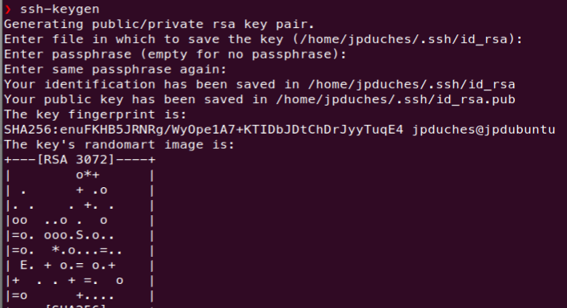

# Exercice 17 - Ansible  - Installation et configuration de base

### Informations
- Évaluation : formative.
- Durée estimée : 3 heures.
- Système d'exploitation : Linux.
- Environnement : Virtuel. 

### Objectifs  

- Déterminer les différents types de tests à effectuer.
- Appliquer la séquence d’exécution des tests selon le service visé.
- Déterminer la pertinence des correctifs proposés.
- Gérer les correctifs de logiciels, du système d’exploitation et des micrologiciels (Firmware).
- Appliquer les correctifs.
- Déterminer les indices de performance des serveurs.
- Paramétrer les indices de performance.
- Mettre en place des mécanismes d’agrégation des serveurs.
- Gérer le stockage.

### Description

Dans cet exercice, nous allons installer Ansible sur votre machine virtuelle.

Voici ce qu'en dit la documentation sur Ansible :

"Ansible est un outil d'automatisation informatique. Il permet de configurer des systèmes, de déployer des logiciels et d'orchestrer des tâches informatiques plus avancées, telles que des déploiements continus ou des mises à jour permanentes sans temps d'arrêt."

"Les principaux objectifs d'Ansible sont la simplicité et la facilité d'utilisation. Il met également l'accent sur la sécurité et la fiabilité, avec un minimum de pièces mobiles, l'utilisation d'OpenSSH pour le transport (avec d'autres transports et modes d'extraction comme alternatives), et un langage qui est conçu autour de l'auditabilité par les humains - même ceux qui ne sont pas familiers avec le programme."

### Environnement de travail 

Nous aurons besoin de deux VMs, votre Ubuntu client déjà utilisé dans les cours précédents. Le client Ubuntu sera la station de gestion et une machine supplémentaire que nous appellerons `srv-apache-[matricule]`. Cette dernière représente une machine qui servira pour réaliser les différents tests. 

Dans cet exercice, nous allons travailler essentiellement sur la station de gestion.


## Section 1 : Protocole SSH 
Ansible est principalement conçu pour gérer des machines à l’aide du protocole SSH ou via des commandes lancées en local. Il est également possible de gérer d’autres types de machines, comme des systèmes Windows, des conteneurs Docker ou encore via des mécanismes d’isolation (chroot ou jail).

Même s’il est possible de passer par des mots de passe pour se connecter aux machines Linux, il est fortement recommandé de passer par des clés SSH. La suite sera consacrée à la génération des clés SSH. Dans l'exercice suivant, vous allez procéder à leur propagation sur les machines à administrer.

### Génération de la clé 


Les connexions SSH se feront avec l’utilisateur *deploy*. Il faut donc créer cet utilisateur sur la station de gestion, créer sa clé ssh et installer la clé sur les noeuds que nous voulons gérer, dans notre cas `srv-apache-[matricule]`.

Il est important d'utiliser un usager différent de votre usager de travail habituel. Ce nouvel usager doit pouvoir avoir les droits sudo pour exécuter les commandes sur la machine de contrôle, mais il devra également exister sur chacun des noeuds gérés.


```bash
 sudo adduser deploy # Création rapide de l'usager
 sudo usermod -aG adm,sudo  deploy  # ajouter au groupe adm et sudo
 su deploy # ce connecter avec l'usager
 cd # ce déplacer dans son répertoire 
```  

La génération de la clé est déclenchée par la commande `ssh-keygen`. On peut lui passer les options suivantes :

- Le type de clé à générer (rsa, dsa ou ed25519) avec -t [rsa|dsa|ed25519].
- L’emplacement où générer la clé avec -f <emplacement-clé>.
- Une passphrase (phrase secrète) pour protéger la clé avec l’option -N. Vous pouvez mettre la valeur "" pour ne pas utiliser de passphrase.
- Un commentaire pour identifier la clé avec l'option -C.
- Éventuellement la longueur de la clé (-b 2048 pour une clé de 2 048 bits, les clés Ed25519 et Ed25519-SK ont une longueur fixe et l'indicateur -b sera ignoré).

Si vous ne passez pas de paramètres à la commande, ssh-keygen produira une clé RSA et la commande demandera les informations suivantes;

- l’emplacement de la clé (par défaut $HOME/.ssh/id_rsa) ;
- une passphrase et la confirmation de la passphrase.

Ci-dessous un exemple de création de la clé sans paramètre :



Pour générer votre clé ssh :

```bash
ssh-keygen -t ed25519 -N "" -C "deploy, Poste de gestion"
```

Pour travailler avec Ansible, il est important de comprendre comment fonctionne l’authentification par clé. Pour cela, la commande SSH procède à un certain nombre d’opérations :

- Vérification de la signature du serveur distant. Si ce dernier n’est pas connu, l’utilitaire ssh proposera de stocker la chaîne présentée par le serveur.

- Récupération des clés privées SSH présentes dans le répertoire .ssh (fichiers id\_rsa, id_dsa ou id\_ed25519) de l’utilisateur et vérification des droits sur les fichiers.

- Présentation des clés aux serveurs distants. Si une clé correspond à une entrée dans le fichier ~/.ssh/authorized\_keys distant, le serveur crée un challenge à résoudre par le client.

- Le client résout le challenge (c’est d’ailleurs à ce moment qu’il faut saisir la passphrase de la clé SSH si vous l'avez configurée) et le renvoie au serveur : l’utilisateur est authentifié.

Les étapes permettent de s’assurer que l’utilisateur est bien celui qu’il prétend être.

### Hébergement dans le cloud

Dans certaines situations (par exemple, le changement souvent de clé SSH pour des machines hébergées dans l’infonuagique), il n’est pas faisable de maintenir la liste des signatures de machines distantes.

La désactivation de ce mécanisme sur le poste de gestion se fait à l’aide des options SSH suivantes :

- Désactivation de la vérification stricte des clés SSH des machines distantes 
    (StrictHostKeyChecking no).

- Stockage des signatures de machines dans le fichier /dev/null 
    (UserKnownHostsFile /dev/null).

Cette configuration se fait en alimentant le contenu du fichier ~/.ssh/config. Ci-dessous le contenu de ce fichier avec ces deux options :

```bash
StrictHostKeyChecking no 
UserKnownHostsFile /dev/null  
```

Par contre, ce n'est pas une bonne pratique de sécurité.

## Section 2 : Installation d'ansible sur la station de gestion

 L’installation d’Ansible peut se faire de plusieurs manières;
 
- par l’intermédiaire des packages du système d'exploitation utilisé;
- à l’aide de l’outil pip de Python (éventuellement combiné avec virtualenv);
- par l’utilisation des archives contenant le code source d’Ansible;
- ou enfin, en interprétant directement le code source en provenance de Git.

Nous allons opter pour les packages système.  
Depuis votre nœud de contrôle, exécutez la commande suivante pour inclure le PPA (personal package archive) du projet officiel dans la liste des sources de votre système :

```bash
sudo apt-add-repository ppa:ansible/ansible
```
Vous pouvez vérifier la liste de vos sources logiciels et tapant la commande suivante :

```bash
ls -l /etc/apt/sources.list.d/
```
Puis, l'installation :

```bash
sudo apt update && sudo apt install ansible -y
```

Vérification de la version d’Ansible

```bash
ansible --version
```

Ci-dessous un exemple de sortie de cette commande (ici avec la version 2.9.6) :

```bash
ansible 2.16.11
  config file = /etc/ansible/ansible.cfg
  configured module search path = ['/home/deploy/.ansible/plugins/modules', '/usr/share/ansible/plugins/modules']
  ansible python module location = /usr/lib/python3/dist-packages/ansible
  ansible collection loaction = /home/deploy/.ansible/collections:/usr/share/ansible/collections  
  executable location = /usr/bin/ansible
  python version = 3.12.3 (main, Sep 11 2024, 09:04:19) [GCC 13.2.0] (/usr/bin/python3)
  jinja version = 3.1.2
  libyaml=true
```

### Modifiez l'emplacement du fichier `ansible.cfg`.

Ansible utilisera le fichier de configuration situé dans `/etc/ansible/ansible.cfg`, sauf s'il y a un fichier `ansible.cfg` dans le répertoire courant. 

Pour que Ansible prenne en considération notre répertoire, nous allons créer un fichier `ansible.cfg` à la racine du répertoire de l'usager deploy :

```bash
vim ~/ansible.cfg
#contenu du fichier :
[defaults]
inventory = inventaire
remote_user //= deploy
retry_files_enabled = False
log_path = ./.traces_d_ansible
```

Ansible recherche un fichier de configuration dans cet ordre :

1. La variable d'environnement <code>ANSIBLE_CONFIG</code>.
2. Le fichier <code>ansible.cfg</code> dans le répertoire actuel.
3. Le fichier <code>~/.ansible.cfg</code> dans le répertoire <code>home</code> de l'usager.
4. <code>/etc/ansible/ansible.cfg</code>


- Pour tester les modifications, appelez à nouveau la commande ansible version:

```bash
ansible --version
```

-
Voici le résultat attendu : 


## Section 3 : Première utilisation 

La syntaxe de base d'Ansible est la suivante :

```
ansible [-m module] [-a arguments] cible
```

Exemple avec le module setup qui se connecte sur la machine et va chercher toutes les informations de configuration :

```bash
ansible -m setup localhost > localhost.setup 
# La sortie est très importante, alors nous l'envoyons dans un fichier qui sera écrit dans un format JSON.
```
- Vous pouvez vérifier le contenu en utilisant cat ou votre éditeur : 

```bash
cat localhost.setup 
```
- Vous pouvez remarquer la quantité importante d'information que contient ce fichier. ll nous sera utile plus tard.
## Section 4 : Création de la machine srv-apache

Utiliser les informations suivantes pour créer la seconde machine :

- Allez dans le dossier : DFC DS -> VM DFC -> Modeles -> ClaudeRoy -> TPL\_2023102\_UbSrv2204_BaseSmall
- Sélectionnez le modèle de VM et cliquez sur le bouton droit de votre souris et sélectionnez <code> New VM from this Template</code>
- Suivez les étapes 
    - Nom de la VM : `srv-apache-[matricule]`
    - Emplacement : DFC DS -> VM DFC -> A24\_4363\_420W45\_ISS\_JPD
    - Stockage : ESXDFC2
- L’utilisateur / mot de passe est : user1 / S0l&il   
- Après votre connexion, changer les informations suivantes 
    - Nom de la machine : <code>sudo hostnamectl set-hostname srv-apache-1</code>.
    - Créer un compte : deploy avec le même mot de passe que sur votre machine de gestion.
    - Membre des groupes sudo et adm.


```bash
 sudo adduser deploy 
 sudo usermod -aG adm,sudo  deploy
```

- Autoriser le service ssh sur srv-apache-1

        sudo apt install openssh-server
        sudo systemctl enable ssh --now
        sudo systemctl start ssh
        sudo systemctl status ssh

- Pour éviter les problèmes de doublon d'adresse IP, je vous recommande de faire les commandes suivantes (vous aurez besoin de refaire ces commandes à chaque lancement de la VM) :

```bash
sudo ip add flush ens160
sudo dhclient -v ens160
ip -4 add
```

## Section 5 : Échange de clé par mot de passe

Dans la suite de l’exercice, les connexions SSH se feront avec l’utilisateur deploy, à partir de la station de gestion.  

La machine srv-apache-1 sera administrée par clé SSH. Par conséquent, vous devez copier la clé ssh de l'utilisateur deploy de la station de gestion vers le serveur srv-apache-1. La copie se fera avec l’outil `ssh-copy-id` suivi du nom (dans notre cas l'adresse IP) de la machine. Cet outil a pour fonction de prendre la clé publique SSH pour la déposer automatiquement sur la machine distante (srv-apache-1) dans le fichier ~/.ssh/authorized_keys.
Il est également possible de faire précéder le nom de l’utilisateur avec lequel se connecter en utilisant une arobase (‘@’).  

Si vous utilisez un chiffrement autre que RSA, vous devez l'indiquer avec le paramètre <code>-i</code>. Voici un exemple :

```bash
ssh-copy-id -i ~/.ssh/id_ed25519 deploy@10.100.2.121
```

Ci-dessous un exemple d’échange de clé avec l’utilisateur de la machine rec-apache-1 :


La clé est maintenant en place. Comme le message vous y invite, il est maintenant possible de se connecter avec la commande <code>ssh deploy@srv-apache-1</code> pour s’assurer que l’échange de clé s’est bien passé :


L’échange de clé est effectué, il est maintenant possible de réaliser les premiers tests avec Ansible. Mais avant tous il faut renseigner l'inventaire d'Ansible sur la machine de gestion.

## Section 6 : Modifier le fichier d'inventaire 

Ansible utilise un fichier d'inventaire appelé `hosts` qui contient des informations sur l'appareil utilisé par les playbooks Ansible. L'emplacement par défaut du fichier d'inventaire Ansible est /etc/ansible/hosts comme spécifié dans le fichier `ansible.cfg`, donc par défaut dans le même répertoire ansible.cfg. Ces fichiers par défaut sont utilisés lorsque Ansible est exécuté globalement. Cependant, pour des raisons de facilité et de sécurité, vous allez exécuter Ansible à partir du répertoire de l'usager deploy, créé précédament, qui est membre du groupe sudo. Par contre, dans notre fichier ansible.cfg, nous avons spécifié que le fichier d'inventaire se nommait `inventaire` (paramètre inventory).

Le fichier d'inventaire Ansible définit les périphériques et groupes d'appareils utilisés par le playbook Ansible. Le fichier peut être dans l'un des nombreux formats, y compris YAML et INI, en fonction de votre environnement Ansible (le défaut est INI). Le fichier d'inventaire peut répertorier les périphériques par adresse IP ou par nom de domaine complet (FQDN), et peut également inclure des paramètres spécifiques à l'hôte. Il est également possible de créer des groupes d'hôtes.

- Avec un éditeur de textes, créer un fichier d'inventaire avec les informations suivantes :

```bash
# Utiliser l'éditeur de texte de votre choix.
vim inventaire

# Contenu du fichier

[Web]
srv-apache-1 ansible_host=X.X.X.X # L'adresse IP de votre serveur

[local]
localhost # Station de gestion 

```

Sauvegarder vos modification et sortez de l'éditeur.  
Au lieu d'utiliser le paramètre <code>ansible_host</code>, vous pourriez ajouter à votre fichier <code>/etc/hosts</code> l'adresse IP et le nom de votre srv-apache-1.

Pour tester l'inventaire , vous pouvez appeler la commande ansible avec les options suivantes :

- le module ping (-m ping) ;
- le groupe sur lequel vous souhaitez travailler (ici Web ou all pour désigner toutes les machines).

```bash
ansible -m ping Web
# Ping sur tous les membres du groupe Web
```

Si la communication se passe bien, vous devriez obtenir le message suivant :


Vous pourriez utiliser un fichier d'inventaire différent avec le paramètre <code>-i</code> : par exemple <code>-i srv-apache-1.inv</code>.

Testons l'ensemble de l'inventaire (All) et pas seulement le groupe Web et ce avec la commande <code>id</code> sur chacun des hôtes. Nous utilisons le module <code>command</code> avec l'argument <code>-a id</code> :

```
ansible -m command -a id all
```
qui va nous renvoyer les informations suivantes :


Vous pouvez essayer les commandes suivantes :

```bash
ansible --list-hosts all
ansible --list-hosts Web:local
ansible -m shell -a "hostnamectl" Web
# La commande suivante a le même résultat que la précédente.
ansible -m shell -a "hostnamectl" \!local

```

## Défis et remise: 

Expliquer pourquoi, lors de la commande <code>id</code> du module commande, Ansible n'a pu se connecter sur localhost et a généré un message d'erreur. Est-il possible de changer ça ?  


Remettez sur LÉA votre réponse avec une capture d'écran de la commande :

```
ansible -m command -a id all
```

Exemple de remise :


## Référence :

[Documentation officielle d'Ansible](https://docs.ansible.com/ansible/latest/getting_started/index.html)  

[Ansible - Gérez la configuration de vos serveurs et le déploiement de vos applications (2e édition) ](https://www.eni-training.com/portal/client/mediabook/home)

[Github-Ansible](https://github.com/EditionsENI/ansible)

[group discussion](https://groups.google.com/g/ansible-project)


