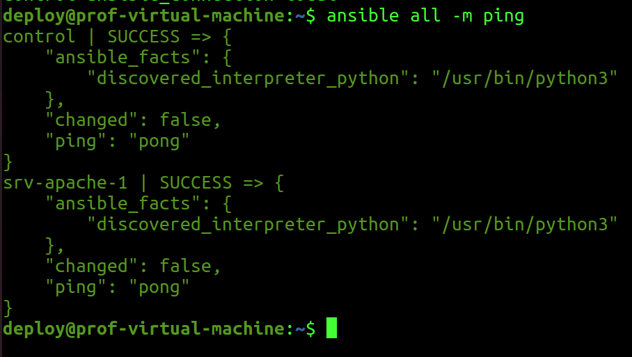
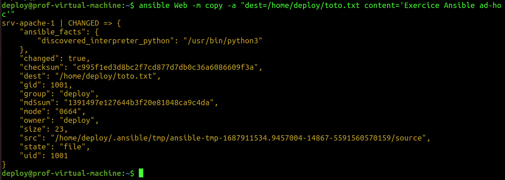
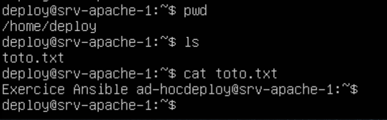
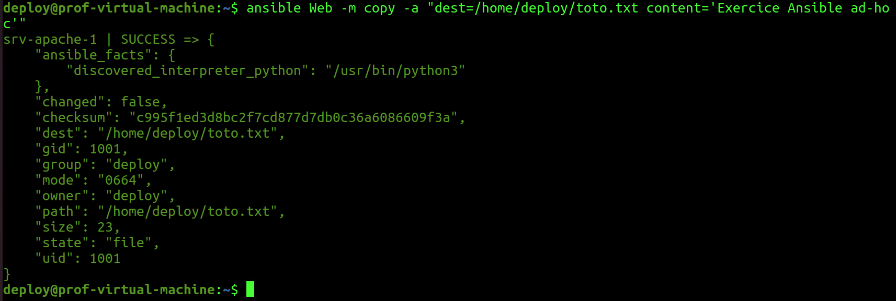
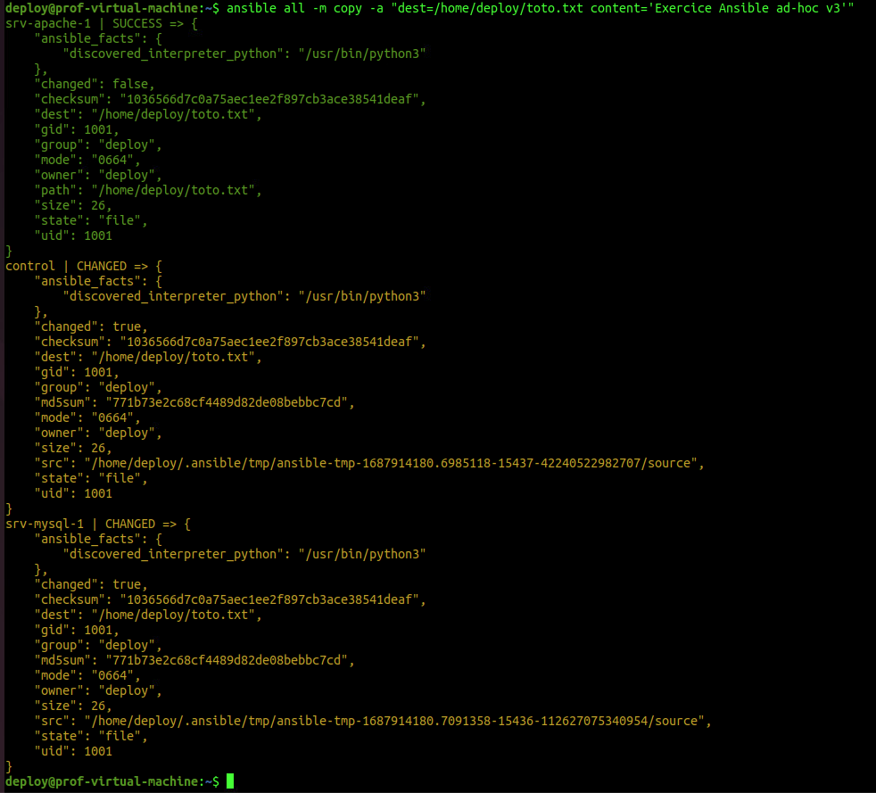

# Exercice 18 - Ansible  - Mode ad hoc

### Informations
- Évaluation : formative.
- Durée estimée : 3 heures.
- Système d'exploitation : Linux.
- Environnement : Virtuel. 

### Objectifs  

- Déterminer les différents types de tests à effectuer.
- Appliquer la séquence d’exécution des tests selon le service visé.
- Déterminer la pertinence des correctifs proposés.
- Gérer les correctifs de logiciels, du système d’exploitation et des micrologiciels (Firmware).
- Appliquer les correctifs.
- Déterminer les indices de performance des serveurs.
- Paramétrer les indices de performance.
- Mettre en place des mécanismes d’agrégation des serveurs.
- Gérer le stockage.

### Description

Dans cet exercice, nous allons utiliser Ansible sur des machines distantes en mode ad hoc.  
Le mode ad hoc est en général utilisé dans ces situations :

- Test de module.
- Lancement de tâche rapidement.

Voici les tâches à réaliser dans cet exercice :

  - Modifier le fichier d'inventaire. 
  - Utilisez une commande ad hoc pour tenter de rejoindre le/les clients Ansible.
  - Utilisez une commande ad hoc pour créer un fichier toto.txt avec le contenu "Exercice Ansible ad hoc" qui se trouvera sur les clients, et ce, dans le dossier /home/deploy/toto.txt. 
  - Vérifier que le fichier a bien été créé avec le contenu.
  - Rajoutez un client et modifiez le fichier inventaire afin de rajouter le nouveau client.
  - Relancez l'action ping et de création de fichiers sur les clients.
  - Vérifier le résultat.
  - Testez l'effet du module "setup" sur votre inventaire.


## Section 1 : Test de l'idempotence

### Sur votre machine de contrôle 

Modifier le fichier d'inventaire pour ne plus avoir d'erreurs sur localhost.

```bash
su deploy
cd
pwd
ansible --version
vim inventaire # ou l'éditeur de votre choix.
```

Contenu du fichier inventaire :

```
[Web]
srv-apache-1 ansible_user=deploy ansible_host=X.X.X.X # IP de votre hôte

[local]
control ansible_connection=local

```

**Attention** : le paramètre <code>ansible_user</code> n'est pas nécessaire, car nous l'avons déjà défini dans le fichier <code>ansible.cfg</code>.

Donc, le fichier d'inventaire devient :

```
[Web]
srv-apache-1 ansible_host=X.X.X.X # IP de votre hôte

[local]
control ansible_connection=local

```

Vérifier le contenu du fichier.

```
cat inventaire
```

Maintenant, nous pouvons faire les commandes ad hoc :  

```bash
# Syntaxe :
# Ansible -i[ fichier inventaire] [groupe de machine dans le fichier d'inventaire] -m [module]
ansible all -m ping
```

**Attention** : comme le fichier inventaire est défini dans le fichier <code>ansible.cfg</code> du répertoire de travail, le paramètre <code>-i</code> n'est pas nécessaire.

Sortie : 




Maintenant, utilisons le module  [Copy](https://docs.ansible.com/ansible/latest/collections/ansible/builtin/copy_module.html). On va créer le fichier sur srv-apache-1 avec un contenu. Mais, seulement sur la machine srv-apache-1 qui est dans le groupe Web :

```bash
ansible Web -m copy -a "dest=/home/deploy/toto.txt content='Exercice Ansible ad hoc'"
```

Sortie :



### Sur votre machine cliente (srv-apache-1)

```
su deploy
cd 
pwd
ls 
cat toto.txt
```



### Sur votre machine de contrôle

Exécutez à nouveau la commande :

```bash
ansible Web -m copy -a "dest=/home/deploy/toto.txt content='Exercice Ansible ad hoc'"
```



**Attention :** remarquez les changements (ou non-changement) au niveau `changed`: il indique false.

Si nous avions fait une copie avec `scp`, quelle aurait été la situation ?

Vous pouvez le tester : 

```bash
vim toto.txt # Ajoutez le contenu 'Exercice Ansible ad hoc'
scp toto.txt deploy@x.x.x.x:/home/deploy/toto.txt #Remplacer x.x.x.x par l'adresse IP de votre serveur
```

Le fichier va écraser l'autre. Ansible lui voit que c'est le même contenu donc ne fait rien.

Essayer à nouveau avec une modification au contenu :

```bash
ansible Web -m copy -a "dest=/home/deploy/toto.txt content='Exercice Ansible ad hoc v2'"
```

Ansible a modifié le fichier.

À nouveau avec la même commande :

```bash
ansible Web -m copy -a "dest=/home/deploy/toto.txt content='Exercice Ansible ad hoc v2'"
```

Rien n'a changé (changed:false)
Essayer à nouveau avec ceci :

```bash
ansible Web -m copy -a "dest=/home/deploy/toto.txt content='Exercice Ansible ad hoc v3'"
```

Le fichier a changé (changed:true)

Il exécute le changement seulement s’il y a changement à faire au fichier. Alors que `scp` vas nécessairement écraser le fichier.

### Il s'agit ici de la notion d'**idempotence** : 

Un logiciel idempotent produit le même résultat souhaitable chaque fois qu'il est exécuté.  
Dans un logiciel de déploiement, l'idempotence permet la convergence et la composabilité, ce qui permet de :  

- Rassembler plus facilement des composants dans des collections qui créent de nouveaux types d'infrastructure et effectuent de nouvelles tâches opérationnelles.
- Exécuter des collections complètes de développement/déploiement pour réparer en toute sécurité les petits problèmes d'infrastructure, effectuer des mises à niveau progressives, modifier la configuration ou gérer la mise à l'échelle. 

## Section 2 : Ajouter un nouveau serveur

Utiliser le même gabarit utilisé pour créer une seconde machine :

- Allez dans le dossier :
DFC DS -> VM DFC -> Modeles -> ClaudeRoy -> TPL\_20231002\_UbSrv2204_BaseSmall
- Sélectionnez le modèle de VM et cliquez sur le bouton droit de votre souris et sélectionnez <code>Nouvelle VM à partir de ce modèle...</code>
- Suivez les étapes 
    - Nom de la VM : srv-mysql-[matricule]
    - Emplacement : DFC DS -> VM DFC -> A23\_4397\_420W45\_ISS\_CR
    - Stockage : ESXDFC2
- L’utilisateur / mot de passe est : user1 / S0l&il.    
 
- Après votre connexion, changer les informations suivantes 

    - Nom de la machine (<code>sudo hostnamectl set-hostname srv-mysql-1</code>) : srv-mysql-1.
    - Créer un utilisateur deploy avec le même mot de passe que sur votre machine de contrôle.
     - Membre des groupes sudo et adm.


```bash
 sudo adduser deploy 
 sudo usermod -aG adm,sudo deploy
 su deploy # se connecter avec deploy
 cd
```

- Pour éviter les problèmes de doublon d'adresse IP, je vous recommande de faire les commandes suivantes (vous aurez besoin de refaire ces commandes à chaque lancement de la VM) :

```bash
sudo ip add flush ens160
sudo dhclient -v ens160
ip -4 add
```


### Machine de contrôle 

- Copier la clé ssh de deploy de la machine de contrôle sur la machine srv-mysql-[matricule].  

- Ajouter la machine à l'inventaire :

```bash
vim inventaire

#contenu du fichier inventaire :
[Mysql]
srv-mysql-1 ansible_host=X.X.X.X # IP de votre hôte

[Web]
srv-apache-1 ansible_host=X.X.X.X # IP de votre hôte

[local]
control ansible_connection=local

```

Vérifiez la connectivité.

```bash
ansible all -m ping
```


Refaites la copie 

```bash
ansible all -m copy -a "dest=/home/deploy/toto.txt content='Exercice Ansible ad hoc v3'"
```

#### Attention  : 

- Ansible fait le travail sur localhost avec changed=true.
- Ansible fait le travail sur srv-apache avec changed=false.
- Ansible fait aussi le travail sur le srv-mysql avec change=true.

Voici la sortie :



**Attention : prenez une capture d'écran pour votre remise.**


## Section 3 : Ansible - Mode ad hoc avec format YAML

Dans cette partie de l'exercice, nous allons utiliser Ansible sur des machines distantes en mode ad hoc mais cette fois, avec un inventaire au format YAML.
 
### Sur votre machine de contrôle 

À l'aide d'un éditeur de texte, reproduire le fichier d'inventaire en format YAML.
Consultez la documentation pour vous aidez : [documentation](https://docs.ansible.com/ansible/latest/user_guide/intro_inventory.html).

Vérifiez vos informations :

```
cat inventaire.yaml
```

<details>
  <summary markdown="span">Résultat</summary>
  
  ```yaml
  # inventaire.yaml
  Web:
    hosts:
      srv-apache-1:
        ansible_host: 10.100.2.128
  Mysql:
    hosts:
      srv-mysql-1:
        ansible_host: 10.100.2.206
  local:
    hosts:
      control:
        ansible_connection: local
  ```

</details>
Maintenant, nous pouvons faire les commandes ad hoc:

```bash
ansible -i inventaire.yaml all -m ping
```

**Attention : prenez une capture d'écran comme preuve de réalisation.**


## Section 4 : Le module setup

Le module setup balai la machine pour vous donner l'ensemble des informations à exploiter dans les playbook que nous utiliserons dans le prochain exercice.

Faites la commande :

```bash
ansible -i inventaire.yaml all -m setup
```

Comme la sortie est trop imposante, renvoyez-le tous dans un fichier :

```bash
ansible -i inventaire.yaml all -m setup > setup.txt
```

**Attention** : il se peut que votre usager <code>deploy</code> ne soit pas connecté en mode graphique, alors vous ne pouvez pas utiliser le mode graphique. 

2 options s'offrent à vous :  
  - Connectez-vous avec l'usager deploy en mode graphique.  
  - Faite une copie du fichier `setup.txt` vers votre usager :

```
sudo cp setup.txt /home/[votreUsager]/setup.txt
```

Remarquer les points suivants pour chacune des machines :  

 - Adresse IPv4 et IPv6.
 - Nos distributions : ansible_ditribution.
 - Les variables d'environnement : ansible_env.
 - Plusieurs informations sur les éléments physiques de la machine :
    - Disque dur
    - Mémoire vive 
    - etc.


## Remise

Placez les captures des deux commandes suivantes (vous avez déjà fait ces commandes dans les sections précédentes) dans un seul fichier et déposez-le sur LÉA dans Travaux.

```bash
ansible all -m copy -a "dest=/home/deploy/toto.txt content='Exercice Ansible ad hoc v3'"
```

```bash
ansible -i inventaire.yaml all -m ping
```

## Référence :

[Documentation officielle d'Ansible](https://docs.ansible.com/ansible/latest/getting_started/index.html)  

[Github-Ansible](https://github.com/EditionsENI/ansible)

[group discussion](https://groups.google.com/g/ansible-project)

[Choisir l'interpréteur Python](https://docs.ansible.com/ansible/latest/reference_appendices/python_3_support.html)
